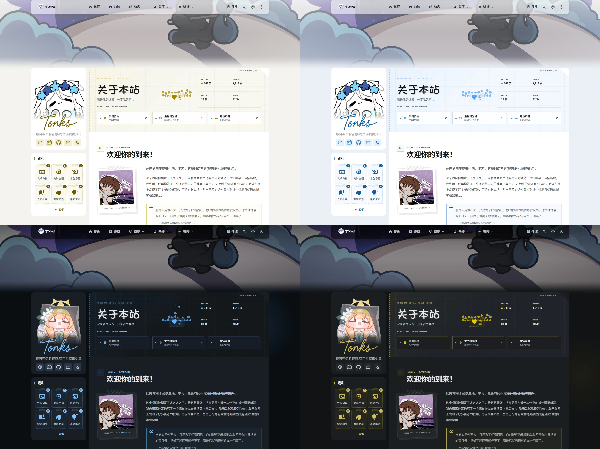
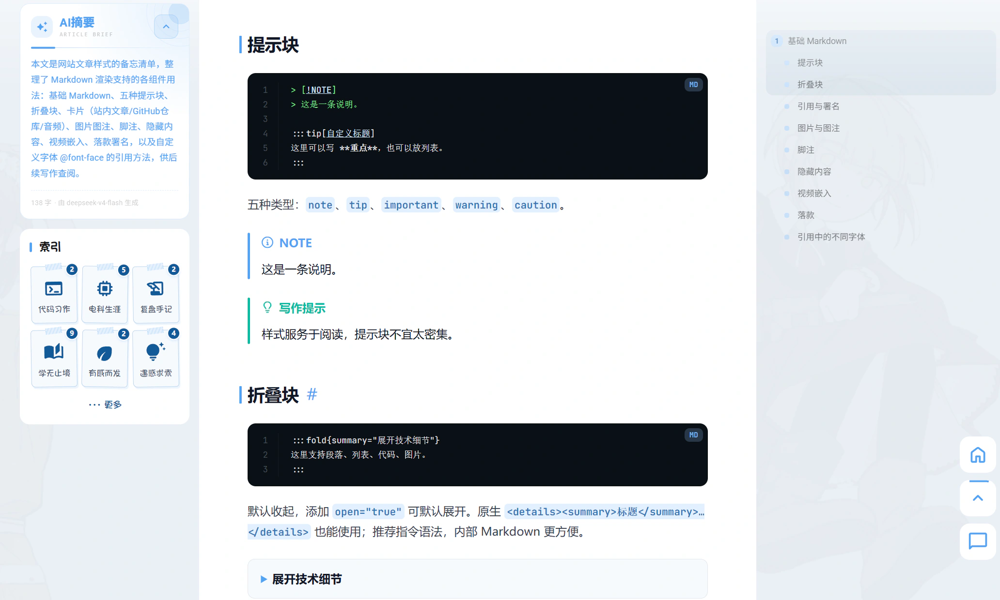
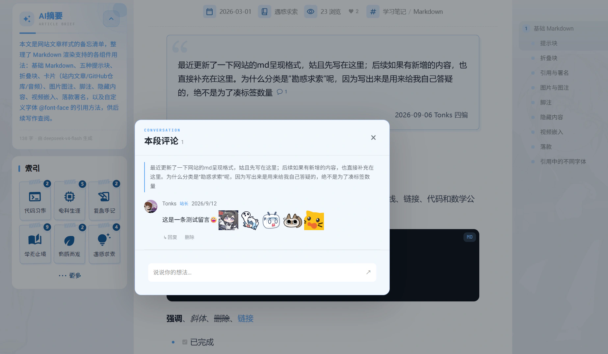
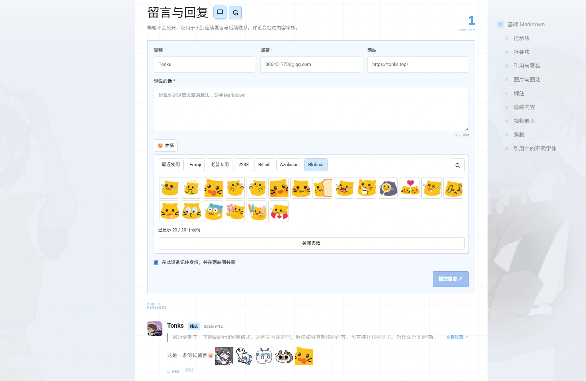
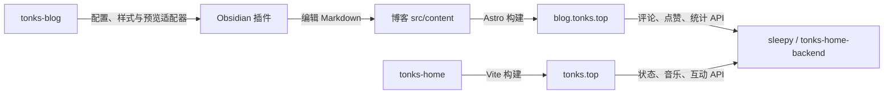

# Tonks Blog

基于 Astro、Svelte 与 Tailwind CSS 的个人博客。以文章阅读为中心，结合四种主题、段落讨论、静态搜索和集中维护的内容数据。

本项目由 [saicaca/fuwari](https://github.com/saicaca/fuwari) 修改而来，部分设计参考 [伏枥之间](https://github.com/LeeHero0803/leehenry-blog)。感谢上游作者。线上站点：[blog.tonks.top](https://blog.tonks.top/)。

> 内容维护见 [src/data/README.md](src/data/README.md) ；贡献流程见 [CONTRIBUTING.md](CONTRIBUTING.md)。

## 界面预览

首页 Banner、随机入口与文章卡片：


<details>
<summary>查看四种主题、文章阅读与评论界面</summary>

蓝 / 金 × 亮 / 暗四种主题：



文章正文、AI 摘要、目录与代码展示：



段落评论与表情：



文末留言板、身份表单和分组表情：



</details>

## 项目地图

这四个项目共同组成 Tonks 的个人站点与写作工具，各自保留独立仓库、依赖与发布流程。按需要克隆即可，无需额外的总仓库。

| 项目 | 职责 | 使用入口 |
| --- | --- | --- |
| [tonks-home](https://github.com/DrTonks/tonks-home) | 个人主页、状态卡片、音乐与桌宠交互 | [tonks.top](https://tonks.top/) |
| [tonks-blog](https://github.com/DrTonks/tonks-blog) | 文章、主题、静态构建与博客预览适配器 | [blog.tonks.top](https://blog.tonks.top/) |
| [tonks-home-backend](https://github.com/DrTonks/tonks-home-backend) | 主页与博客共享的状态、统计、评论等 API | 源码目录常用名 `sleepy` |
| [tonks-obsidianEditor](https://github.com/DrTonks/tonks-obsidianEditor) | Obsidian 格式插入、表单与按需博客预览 | 安装到博客 `src/content/.obsidian/plugins/tonks-blog-tools/` |



博客可单独构建静态页面；动态互动需要后端。Obsidian 插件是可选的本地写作工具，不参与线上服务，也不要求启动 Astro。博客仓库的本地目录沿用 `blogExample`，与 GitHub 上的 `tonks-blog` 是同一个项目。

## 特色

### 阅读与内容

- Markdown / MDX 文章、分类标签、归档、置顶文章与前后篇导航。
- KaTeX 公式、Mermaid 图、Expressive Code 代码展示、PhotoSwipe 图片查看。
- 文章 AI 摘要使用预生成数据，不在每次访问时调用模型；正文目录与摘要分开。
- Pagefind 静态全文搜索、RSS / Atom、站点地图和 Open Graph。
- 关于、友链、项目、历程和相册页面；结构化内容集中在 `src/data/` 维护。

### 外观与交互

- 蓝色 / 金色与亮色 / 暗色组成四种主题，访客偏好保存在本地。
- 桌面和移动端独立 Banner，支持轮播开关、首页随机入口贴纸。
- Swup 无刷新导航；主题过渡、可选水波纹及桌面头像粒子效果。
- 移动端文章目录使用系统字体；无文章正文目录的页面隐藏入口。
- 字体子集与图片优化减少下载体积；构建保留资源引用检查。

### 评论与互动（需要专门的后端，也可以自己迁移到twikoo等系统）

- About / Friends 留言、文章评论与段落评论共用专属后端，不再内置 Twikoo。
- 非草稿、非加密文章启用评论；段落映射独立生成，不在 Markdown 正文插入标记。
- 段评弹窗、回复树、分组表情和 Markdown 内容；文末汇总讨论并提供原段落定位。
- 访客身份与个人主页联动需要正确的域名及 Cookie 配置；不能假定 fork 或 localhost 自动共享正式站身份。
- 浏览、点赞、评论计数依赖后端真实数据。静态托管本身不提供数据库、审核或管理员 API。

实现、映射变更和部署契约见 [文章与段落评论](docs/article-comments.md)。音乐播放器、日记页、技能页和 Live2D 已移除；文章中介绍旧系统的历史内容仍保留。

## 本地运行

建议使用 Node.js 22（与 CI 一致）、pnpm 9.14.4、Python 3，并安装字体构建依赖：

```bash
pnpm install --frozen-lockfile
python -m pip install -r requirements-font.txt
pnpm dev
```

默认地址为 `http://localhost:4321`。不接后端也可开发静态页面；互动数据无法完整使用。

需要后端时，将 `.env.example` 复制为 `.env.local`，把 `SLEEPY_DEV_PROXY_TARGET` 改成获授权使用的 sleepy 地址。开发服务器代理同源 `/api` 请求。不要提交真实服务器信息、密钥或 `.env.local`。

`PUBLIC_SLEEPY_API_BASE` 是浏览器直接请求后端的可选方案，需要后端允许本地 Origin 的 CORS。优先使用开发代理。

`pnpm dev:comments-preview` 可使用隔离评论预览服务，但当前脚本要求 `../sleepy/sleepy_app/` 存在；仅克隆本仓库时不能直接使用。数据库保存在 `.cache/`，详见评论文档。

| 命令 | 用途 |
| --- | --- |
| `pnpm dev` | 开发字体子集及热更新服务 |
| `pnpm build` | 完整构建、字体子集、搜索索引与产物验证 |
| `pnpm preview` | 预览 `dist/` |
| `pnpm new-post <名称>` | 创建文章 |
| `pnpm font:subset` | 生成字体子集 |
| `pnpm test:production` | 生产验证脚本测试 |
| `pnpm check:production` | 检查当前构建产物与来源一致性 |
| `pnpm check` | Astro / TypeScript 检查（CI 必须通过） |

`pnpm ship` 会执行发布流程，不是普通构建命令。贡献者无需运行，也不应使用原维护者的服务器凭据。

## 内容维护

| 内容 | 入口 |
| --- | --- |
| 站点标题、导航、主题、Banner、侧栏 | `src/config.ts` |
| 文章与随文图片 | `src/content/posts/` |
| 摘要数据 | `src/content/ai-summaries.json` |
| 友链、历程、项目、相册、首页贴纸 | `src/data/` |
| 关于页实际布局 | `src/pages/about.astro` |
| 公共素材 | `public/` |

文章示例：

```yaml
---
title: 文章标题
published: 2026-09-14
description: 一句话简介
image: ./cover.jpg
tags: [Astro, 前端]
category: 代码习作
draft: true
pinned: false
showCoverInContent: false
---
```

完成后把 `draft` 改为 `false`。文章迁移、重命名及段落改动可能影响评论归属，应先阅读 [文章写作](docs/article-writing.md) 和 [评论映射说明](docs/article-comments.md)。

图片保持现有自动优化链路，不必为清理功能而手动全量改写为 WebP。友链的本地头像机制也保留。参见 [图片优化](docs/image-optimization.md)、[友链头像](docs/friend-avatars.md)。

### 使用 Obsidian 写作（可选）

将 `src/content` 作为 Obsidian 仓库打开，文章仍保存在 `posts/`。安装 [Tonks 博客工具](https://github.com/DrTonks/tonks-obsidianEditor#安装到博客) 后，可以通过右键菜单插入博客格式、填写卡片参数，并在 Obsidian 内切换四种主题预览。

博客负责 `editor/blog-editor.json`、正文 CSS 与本地预览适配器；插件负责菜单、表单和预览容器。新增格式通常在本仓库完成，维护步骤见 [editor/README.md](editor/README.md)。插件与适配产物需要单独安装、构建，不会随克隆博客自动启用。

## 构建与部署边界

当前步骤见 [维护与发布指南](docs/maintenance.md)；历史执行记录见 [文档索引](docs/README.md)。

`pnpm build` 的静态产物在 `dist/`。发布自己的站点前，应修改 `astro.config.mjs` 中的 `site` / `base`、个人资料、外部链接与后端配置。

正式评论还需要把本次构建的 `dist/community/comment-manifest.json` 同步给后端，不能只上传前端。后端源码见 [tonks-home-backend](https://github.com/DrTonks/tonks-home-backend)。

现有 GitHub Actions 在 main 推送及面向 main 的 PR 上运行 `pnpm check` 与 Astro 构建，不自动发布，也不等同于本地 `pnpm build` 的完整字体、搜索和产物验证流程。

## 维护与贡献

见 [贡献指南](CONTRIBUTING.md)。

## 致谢与许可

感谢 [Fuwari](https://github.com/saicaca/fuwari)、[伏枥之间](https://github.com/LeeHero0803/leehenry-blog) 及相关开源项目。代码沿用 [MIT License](LICENSE)，保留原始版权声明。文章、照片、插画、字体及其他素材需分别遵守其来源许可，不能将代码许可证视为所有内容的转载授权。
