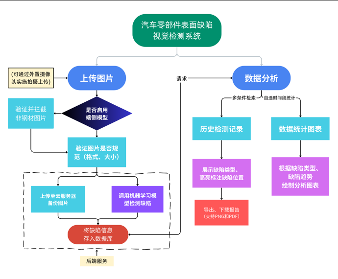
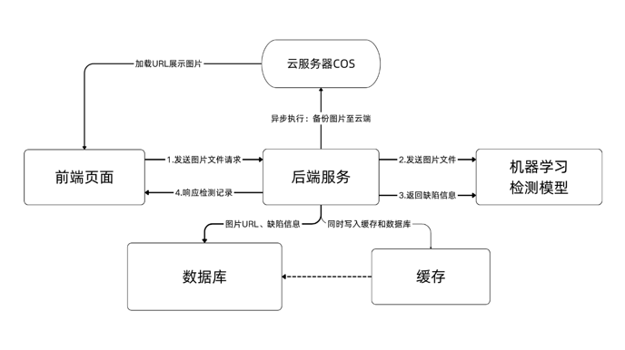
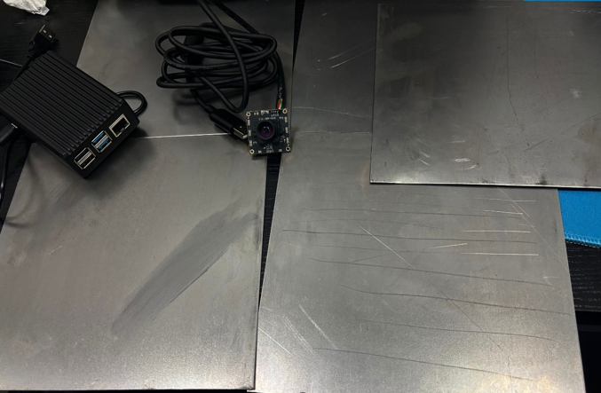

#### 项目展示视频：

<iframe width="100%" height="468" src="//player.bilibili.com/player.html?bvid=BV1Mxs8z5Eha&p=1&autoplay=0" scrolling="no" border="0" frameborder="no" framespacing="0" allowfullscreen="true" &autoplay=0> </iframe>

## 关键模块设计

#### 模块设计概要

​	该项目采用Docker实现前后端分离，利用Docker容器化部署，开发、测试、生产环境通过相同的容器镜像运行，每个容器独立运行，避免进程或端口冲突；对于机器学习场景，Docker 解决了环境依赖复杂、GPU 资源调度和模型版本管理等痛点，适合应用到该项目中。

> 图1.1-1 功能模块设计

 

> 图1.1-2 项目网络架构设计

#### 检测模型模块

·    **混合架构**：YOLOv5s检测网络 + 轻量化分割网络（SAM-Adapter），结合SE/CBAM注意力机制，实现缺陷定位与像素级分割。

·    **自监督对比学习**：基于SimCLR框架，利用无标签数据预训练，增强特征泛化能力。

​	模型在NEU-DET数据集上达到92.5%的mAP@0.5，单图检测耗时44.2ms（含预处理、推理、后处理等全部步骤，不含前后端网络传输耗时），误检率与漏检率均低于10%；系统支持工业生产实时检测，兼容多平台部 署；创新性提出分层注意力策略、动态权重损失函数及多任务联合微调方法，显著提 升复杂场景下的检测鲁棒性。

#### 数据增强与优化模块

​	数据集采用NEU-DET钢材表面缺陷数据集作为数据来源。该数据集由东北大学提供，包含了六种常见的钢材表面缺陷类型：轧制氧化皮（rolled-in scale）、斑块（patches）、开裂（crazing）、凹痕（pitted surface）、包含物（inclusion）和划痕（scratches）。数据集包含1,800张灰度图像，每种缺陷类型300张，图像分辨率为200×200像素。

·    **缺陷特异性增强**：针对裂纹/氧化皮/斑点缺陷设计差异化增强策略（几何变换、CLAHE、弹性形变）。（名称根据东北大学数据集提供的缺陷类型对应。）

·    **模型轻量化**：剪枝、量化（Int8）、知识蒸馏，模型压缩至13.7MB。

#### 前端交互模块

·    **端侧AI拦截**：基于MobileNet_v2的二分类模型（TensorFlow.js），拦截非钢材图片，降低服务器负载。

 

> 图1.2-1 实时检测设备（工业摄像头、树莓派与含缺陷的钢板）

·    **实时摄像检测**：通过WebRTC调用工业摄像头，支持自动上传和间隔拍摄上传，模拟实际工业生产环境。

·    **缺陷信息展示：** 通过OffScreen Canvas和Dom克隆，实现动态高亮非破坏性标注缺陷位置，根据缺陷颜色映射，直观简约；支持报告导出。

#### 后端服务模块

·    **异步检测流程**：Spring Boot + Redis缓存优化，结合WebSocket实现高并发请求处理与结果推送。

·    **数据管理**：MySQL存储检测记录与缺陷信息，支持多条件检索与定时备份恢复。

## 二. 创新要点

#### YOLOv5s与轻量化分割网络的混合架构

​	将YOLOv5s检测网络与轻量化分割网络相结合，构建了一个混合架构的缺陷检测系统。相比单纯的检测或分割方法，混合架构能够同时提供缺陷的位置、类型、形状和面积等多维信息，满足工业质检的全面需求。特别是对于形状不规则的缺陷，分割网络提供的像素级掩码能够更准确地描述缺陷的几何特征，有助于缺陷的精确测量和严重程度评估。

​	该轻量化分割网络借鉴了SAM的设计思想，但进行了大幅简化；同时，我们设计了创新的特征共享机制，使检测网络和分割网络能够共享浅层特征，减少冗余计算，提高系统整体效率。这种设计使得混合架构的计算开销远小于两个独立网络的简单组合，为实时应用提供了可能。

#### 基于SE和CBAM的注意力增强特征金字塔

​	在标准特征金字塔网络的基础上，我们引入了SE和CBAM两种注意力机制，构建了注意力增强特征金字塔。这种设计能够自适应地强调重要特征，抑制无关特征，从而提高对复杂背景中细微缺陷的检测能力。

​	与传统的注意力机制应用不同，我们采用了"分层注意力"策略，即在不同层次的特征图上应用不同类型的注意力机制：在低层特征图上主要应用空间注意力，以保留更多的空间细节；在高层特征图上主要应用通道注意力，以增强语义信息。这种分层策略充分利用了不同注意力机制的优势，取得了比单一注意力机制更好的效果。

#### 基于MobileNet_v2的钢材验证二分类AI模型设计

​	模型基于TensorFlow.js技术（由Google开发、基于Javascript语言的开源机器学习框架）和MobileNet_v2预训练模型，具有能在浏览器端运行的能力；导出的模型以端侧AI的形式直接挂载在前端单页面应用中，模型的调用不经过后端和浏览器网络通信。模型设计为简单的二分类：判断是否是钢材图片；直接效果为在前端直接拦截非钢材图片的上传。
