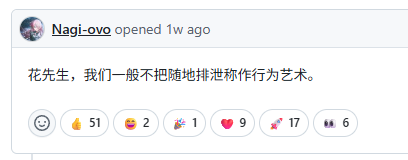
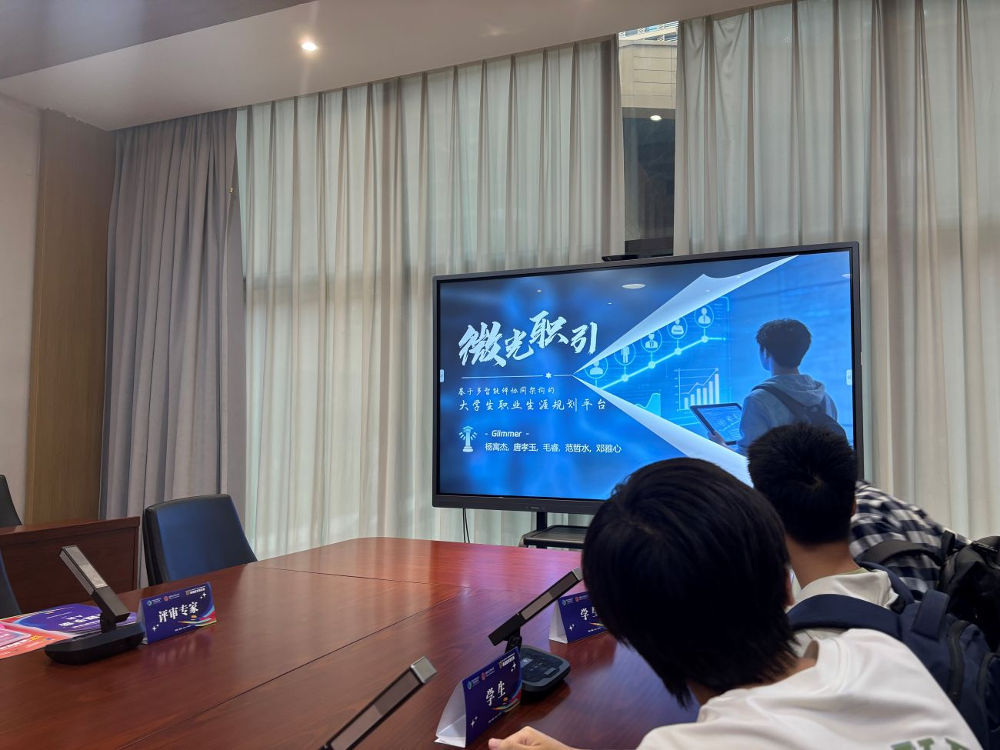

# 项目在线演示链接
[点我跳转——微光职引智能体](https://career-planner.tonks.top/)

公开的演示链接里没有上后端的大模型推理，只有一些基础的功能，附带了我们整理的岗位资料库，岗位资料有效期大约截至2026年2月，没有什么参考价值。做了管理端但是考虑到没有稳定的数据来源，大概不会进行更新了。
# 随笔与答辩心得

> 想到哪里写哪里，如感到文字混乱还请见谅。想参考答辩问题的可以直接跳到对应赛区答辩的位置。

今年打了两个比赛，2026年第17届服创大赛和全国大学生计算机设计大赛，战线拉得很长，从2月打到8月末，如果服创赛题早一点发就是从12月打到次年8月，我们这一届偏晚了。过程还是很累的，要从0开始做一个项目，做市场调研和产出各种文档，开各种迭代的会议，课内的压力也比较大；计设那边的事情倒是不多，前期只有一个线上答辩的环节要准备。

我偶尔还是能闲下来的，但是精力毕竟有限，很难顾及所有的人际关系，和工作室/班级里其他人的交流也变少了。

我不怎么看书了，我越来越依赖AI了。当然在代码方面这是不可避免的；但我发现我的语言组织和表达能力似乎也受到了一定的冲击。我总是静不下来，是一个比较浮躁的人；我也有尝试过B站上那些“15分钟搜索、5分钟整理、1分钟阐释”的对信息处理能力的挑战，效果不尽人意。我本就不擅长在观众前表达自己，答辩的时候也是紧张到胃痉挛，话都讲不利索。在我自信的领域也许能够把话讲明白，而我最大的问题在于不自信。也许该慢慢来。

赛题的准备经过了一个压力很大、很忙、一眼望不到头的半年。或者说是一个充实的半年，我这样安慰自己。

我的博客在这半年里基本断更了。其实本来也没有什么好写的（）但是我觉得写点东西记录一下总是好的，锻炼一下表达能力什么的。我比较悲观，但是我尽量不变成那种**一切都用AI代笔的人**。当然我也没有资格评价谁，至少花叔在自媒体领域里我还是望尘莫及的，他花大钱用AI产出大份是真的有人买单的，我在写博客随笔这种事情上也这么搞就显得毫无意义了。

我的小说已经在仓库里吃灰许久，很久没有再写上新的文字了，我想它大概这辈子都不可能完结了。我写得太意识流太拖沓了，写了10万字男女主才刚碰面。发给AI锐评的结果是“墨迹拖沓和故作高深”，这当然很打击人；但是我一想到就算未来真的完结且发布了，我的全部读者也就是爬虫（也许没有被爬的价值）和一群流口水的AI，就又觉得没有结局也许是件好事。

总之先放着吧，~~来不及也没关系，忘记了也没关系~~。

AI时代下我很焦虑，我常常想这也许是最后一届需要组队分工合作的比赛了，以后只要肯花钱，指挥各种Agent，一人成军就好了（）软工的消失可能就在这几年了，专业壁垒约等于0了。

说回比赛，服创的初赛是线上审，直接出结果（分出晋级名单、部分省二和省三名单）；晋级之后就要飞去对应的赛区进行准备和答辩。我们大概在3-5月准备了一个初期的demo，提交后又要投入到迭代中。如果实在太赶的话，可以考虑等获奖名单出来之后再迭代，减少沉没成本。之前我们隔壁有个队伍连皮包公司都找好了，什么软件专利也全上了结果就拿了个三等奖，没去到线下，确实会比较打击人，对创作热情来说也是一种消磨（虽然我觉得很难对写这种项目产生热情）。

等名单的这段时间比较煎熬，期间还打了个大学生计算机设计大赛，省二，不算多好的名次，但是能拿去抵消实训之类的学分，个人还是比较满意的。

## 西安——区域赛决赛

第一次到外省的线下进行答辩，比较紧张。赛前准备了许多，其实最后也没用上多少；所谓的专家大多是外包，其实也不一定懂多少技术上的内容，重点还是要自己有底气。酒店随便订个离得近的就行，西电的那个校区交通不太方便。

答辩室长这样：

比较气派（比电科大气派多了），和评委们面对面坐着压力也很大。

赛题比较基础的指标一定要弄明白，涉及到项目背书或者软著/专利什么的最好早点去申请，不然比赛的时候基本下不来。不要把项目包装过头了，看着太高大上未必是好事，有一定技术深度和创新是很重要的。
当然区域赛的评委们可能不会太注重技术细节上的拷打，就我个人感觉，问了一些很莫名其妙的问题，比如：

- ***你们的模型是使用企业的数据集来强化和训练的吗？***

显然不是，因为我们做的是Agent而不是模型。其实类似于最近比较火的dsh或者说codex那种类型的，本质上是用Springboot ai做的harness（后面有用python重构貌似）；模型调用的是阿里的千问大模型。

评委问这些问题的时候就感觉不太妙，感觉答辩质量不是很高，但是最后也还是把这个问题简单带过去了。
（我们没有很详细地解释llm和Agent的区别，但是仍然要讲一些作为答辩的基础。可以看出这次的评委确实不是很懂，但是需要尽量保持谦虚和耐心，活跃气氛）

- ***你们这个Github认证，是需要用户在你们网站上输入账号密码吗？***

> 不是。
> 我们注册了一个Github APP，能够以只读权限获取用户的项目经历、贡献、技术栈等，用户只需要授权，并不需要输入账号密码；授权后APP将用户的项目经历信息发送给agent的总控层，激活对应的专家去进行用户画像的补强和对应评分。

- ***你们的这个指标能够反映学生的真实水平吗？***

> 我们相信能（）

其实这是废话来着，我们当然不能完全信任大模型给出的分数；可是“微光职引”只对学生的简历进行建模和评分，一份虚构的简历本就是“不可信”的；因此我们才使用Github APP做用户画像补强，当然这也不能够说明评分足够可靠；我们缺乏真实用户数据的积累，这是早期项目起步的劣势，是通病而不是缺点。

之后就没有什么好说的，我们比较幸运地晋级；之后进行了一些迭代。

## 无锡——全国总决赛

虽然我对我们的项目很有信心，但是国一的名额真的太少了；能拿到国二已经是意外之喜，所以这次反而没有很大的心理压力。软件园在郊区，晚上没地方逛；附近的酒店还死贵，桔子酒店居然要350一晚，天怒人怨了。

忘记给软件园天鹅座拍照了，其实不如西电气派；答辩室也是小小的挤在一起，设备也不比区域赛决赛的配置高，不过主办方在最后的颁奖典礼上出手阔绰了许多，请大家去大酒店里的翡翠厅里坐着；评委们看着也比上次要专业，会问一些技术细节和算法上的问题。

- ***现在市面上其实有很多招聘软件的AI都能做到类似的功能，跟其它软件的AI相比，你们项目的优势是什么？***

> 智联招聘和boss直聘的ai主要起辅助作用，协助检索岗位和简历优化，kord战略智能体也只是纯大语言模型输出，它们都属于被动响应式工具，可能只在求职短期环节起作用，我们的微光指引智能体不是单轮问答，而是全程参与到职业路径规划过程中。

- ***企业要求的指标是怎么测的？***

这里我们回答得太老实了，应该是个丢分点。我们确实没有做一个大数据的测试，只是自己收集了几十份简历去测，评委们大概觉得覆盖得不全没有说服力；

这类关于赛题本身的指标很重要，但是我们没有怎么准备，因为企业的描述本身也是模糊不清的。我们也因此陷入了“企业自己都没说明白，那就不会问”的误区，事实上越是类似的指标和问题，越应该找一套能自圆其说的想法去解决它，简历匹配度该怎么测，可以自己设计一套算法和benchmark，没必要钻牛角尖说“企业也没有给”。

- ***关于学生简历画像的评分，你们的算法是什么？还是说让大模型自己输出？***

本质上是让大模型自己吐分数；我们的算法是指约束大模型的算法，例如将38个岗位数据的向量化与学生的经历去匹配，做余弦相似度什么的，这部分是后端负责的，我也不是很懂；

直接说让大模型去判断会显得我们的系统很呆，很容易出现幻觉的样子；但是我们确实没有很好的算法去把语言文字信息量化成分数，如果只做关键词提取那就没意义了，毕竟之前提到简历的信息本身还是不可信的，学生可以通过反复测试关键词来刷分。我个人认为引入大模型去处理是对的，无非就是工具的设计和调用工具的细粒度问题。

---

颁奖是按批次的，所以能提前知道自己的奖项；如果不是一等奖的话，不建议多人去现场，如果真的没人在现场也没事，后续奖牌是可以邮寄的。我记得颁奖典礼上唱了两首歌，听领导们吹水吹了1个多小时，然后才开始一个个发奖牌；全国总决赛颁奖典礼是有直播的，直接在线上看即可。

我们到翡翠厅现场里呆了很久，情绪没有当初在西电时那么激动，没能拿到一等奖在意料之中；国二已经是很不错的成绩了，至少在加分上与国一差距不大；学长和学姐很极限地在9月预推免名单出来之前拿到了获奖证书电子版，可喜可贺。

我应该会在某个不远的未来，闲下来读会儿书、抿口茶，怀念最好的五个人。