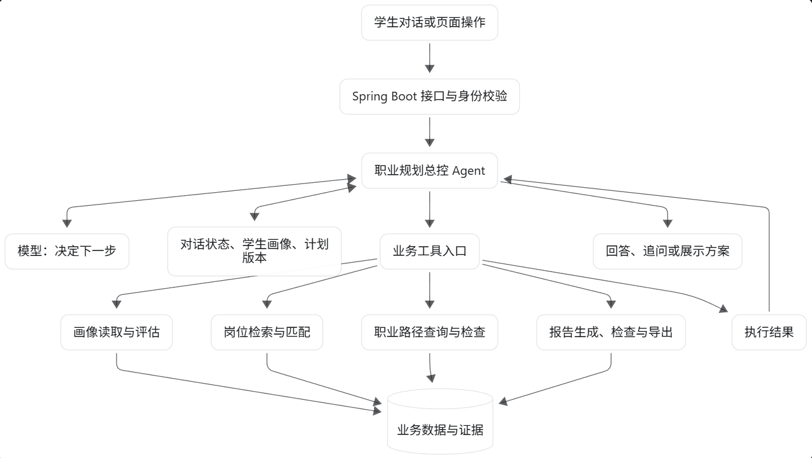
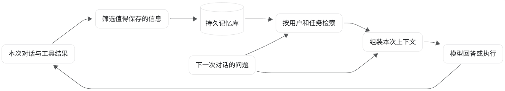

由于“微光职引”的后端被敲定为Springboot，我们也考虑了Spring ai作为智能体实现的框架；Spring AI 当然能做真正的 Agent，官方工具调用机制是：把工具定义交给模型，模型选择工具，应用执行，结果回传，循环到模型给出最终回复。但我们仍需设计工具、上下文、状态和停止条件。

从技术栈选型的角度来看，Spring ai是更好的选择，后端也确实是这么做的；而我想要从其他方面去考量：现在AI技术已经很发达了，没有什么“技术栈门槛”（对于我们普通大学生来说，大多数人的代码能力不如ai，即使是自己擅长的区域）；而我真正想研究的重点确实是 Agent本身，比起生产级的产品，我更希望能增强自己对于agent的理解。所以我决定后续向 pi 这个方向探索。

现在还是先学习上下文与提示词工程，了解一下关于记忆的内容。

## 如何让 Agent 在对话结束后仍然拥有记忆？

对记忆的理解通常包括以下内容：
- **模型参数中的知识**：训练形成的能力和知识
- **当前上下文**：这次推理实际收到的指令、历史消息、文件内容、工具结果等。
- **外部持久状态**：应用保存在文件、数据库或服务端会话对象中的信息。

如果感觉到模型“记得刚才说过什么”，往往是因为应用在后续调用中带上了历史，或者服务端管理了会话状态。比如OpenAI 的 Conversations API 就可以持久保存会话对象，并跨会话、设备或任务继续使用，我使用GPT聊天的时候经常觉得它很智能，居然不是按会话隔离，会记得一些其他的会话问过的内容（但是也会强行关联一些其他的无关内容，所以我不好评价这个系统）

Agent的短期记忆好比电脑的内存，直接对应上下文窗口，包含了系统提示、用户与智能体的对话历史、工具调用结果以及模型即将生成的回复；而长期记忆则需要通过外部系统构建。

为了让 Agent 跨对话拥有记忆，可以设计成下面这个闭环：

## 给Agent地图而不是说明书

虽然用户的个性化记忆很重要，但是原则上不要让context变成数据库。如果每次学生用户发消息，都把这些内容塞给模型：

- 完整聊天记录和整份简历
- 全部岗位画像、职业关系图谱
- 所有评分标准、规划方法
- 四个智能体专家的完整提示词
- 报告模板、历史计划和使用说明

同时收到大量与这次问题无关的信息，既增加成本，也可能影响当前回答。

应该给索引而不是详细的说明书。Codex研究员曾提到：

:::quote{author="—— Open AI《工程技术：在智能体优先的世界中利用》"}
情境管理是使智能体在大型和复杂任务中有效发挥作用的最大挑战之一。我们学到的最早经验教训之一很简单：**要给 Codex 的是一张地图，而不是一本 1,000 页的说明书。**

我们尝试了“一个大型的 [`AGENTS.md`⁠](https://agents.md/)”方法。可想而知，这是一次失败的尝试：

- **情境是一种稀缺资源。** 一个巨大的指令文件会挤掉任务、代码和相关文档 — 因此智能体要么会错过关键约束条件，要么开始针对错误的约束条件进行优化。
- **过多的指导反而变得无效。** 当一切都 "重要"时，一切都不重要了。智能体最终会在本地进行模式匹配，而不是有意识地进行导航。
- **它会立即腐烂。** 一本庞杂的手册会变成陈旧规则的坟场。智能体无法判断哪些信息仍然有效，一旦人类停止维护它，此文件就会悄然成为一个颇具吸引力的麻烦源头。
- **这很难核实。** 单个 blob 不适合进行机械检查（覆盖率、新鲜度、所有权、交叉链接），因此漂移是不可避免的。
:::

可以这样设计：

| 层次      | 内容                     | 时机         |
| ------- | ---------------------- | ---------- |
| 基础规则    | Agent 的职责、证据要求、工具使用原则  | 每次推理的基础上下文 |
| 简短导航与状态 | 有哪些资料、如何查询；用户当前目标和任务进度 | 对话开始或状态变化时 |
| 详细材料    | 简历原文、岗位证据、匹配细则、完整报告    | 当前任务需要时读取  |

Agent 决定是否查询、查询什么、结果不足时是否换条件继续查；检索岗位的工具内部可以使用固定而可测试的检索流程。**这才比较符合“让模型决定下一步”的目标。** 因为我们要做的毕竟是一个Agent，而不是Workflow。

## Mem0和RAG

“陪伴式职业规划”需要更持久化的记忆，我们会考虑选用Mem0。

Mem0 是给 Agent 管理长期记忆的组件，适合记录学生的偏好、经历（从简历中提取）和历史决策；而岗位数据集则更适合做成独立的岗位知识库，通过结构化查询和 RAG 使用。

比如学生说：

> 我之前想去上海，现在希望留在西安。做过一个 Java 项目，不太喜欢前端工作。

记忆系统可以从中提取值得保留的信息，关联到该学生；下次对话时，再根据当前问题检索相关记录。Mem0 提供了这样的记忆提取、存储和检索能力，有开源实现和托管服务。

| 数据               | 主要存放位置      | 原因             |
| ---------------- | ----------- | -------------- |
| 学历、专业、证书、已确认技能   | 结构化学生简历     | 需要准确查询、修改和验证   |
| 交流中透露的偏好、顾虑、决策理由 | Mem0 或自建记忆库 | 内容开放，适合按语义检索   |
| 当前计划、完成进度、报告版本   | 业务数据库       | 需要明确状态和版本      |
| 最近对话、待追问的问题      | 会话状态        | 用于接着完成当前任务     |
| 岗位描述、岗位要求和来源     | 岗位知识库       | 是公共领域资料，需要独立治理 |

关于RAG的部分，由于不是我负责的，可能只了解了一部分；向量擅长处理不同表述之间的语义联系；技能字段和关键词能帮助精确区分 Java、JavaScript 等术语，我们这次也打算使用之前打过的向量检索优化比赛的PostgreSQL＋pgvector做这个内容。

初次检索叫“召回”，目的是先找出可能相关的候选；重排序则更仔细地比较问题与候选内容。可以先召回一批，再挑出少量最相关的岗位。这些数量需要测试确定，初版也可以不加重排序，先观察检索错误在哪里。最后把内容交给agent调用相应的匹配工具和算法。