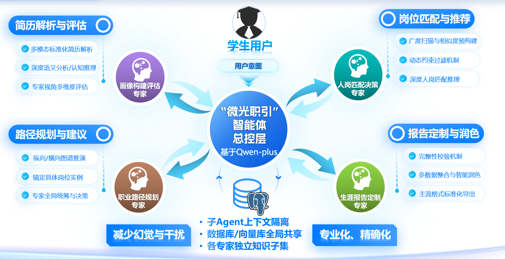
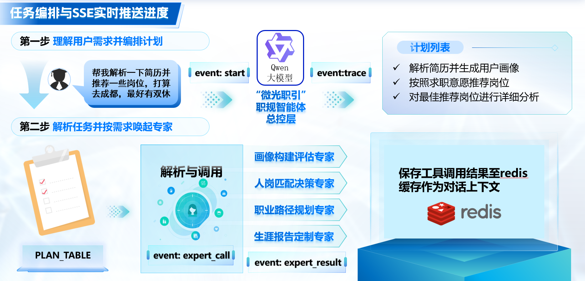

在“微光职引”的后续设计里，我们添加了总控加四大专家的架构：画像构建、人岗匹配、职业路径规划、生涯报告。

但是**为什么要拆成多个 Agent？**

## 上下文边界

在同一条 prompt 里写“请四位专家依次发表意见”，通常只是一次调用中的角色模拟。真正拆开以后，每个 Agent 有自己的任务、上下文、工具和执行循环；它们可以调用同一个模型，也不必对应四个微服务。

比如路径专家收到“比较两个方向的准备路径”，可以自己查岗位、查图谱、检查时间投入；发现准备周期太长，再找替代方案。至于计算匹配分数、导出文件，内部仍然可以是固定算法或普通函数。

是否需要独立决策，是判断一个模块要不要成为 Agent 的主要依据。报告模块如果只是把已有结果排成文章，一次模型工具调用可能就够了。

~~当然，本来也打算做成工具调用，只不过multi-agent看起来更高端一点~~

不过这确实也是一个学习多agent协作的好时机（高情商）。

A/在[《How we built our multi-agent research system》](https://www.anthropic.com/engineering/multi-agent-research-system)中介绍了总控与子 Agent 的分工：子 Agent 在独立上下文里探索，再压缩出重要结果交给总控。

:::quote{author="——How we built our multi-agent research system"}
The essence of search is compression: distilling insights from a vast corpus. Subagents facilitate compression by operating in parallel with their own context windows, exploring different aspects of the question simultaneously before condensing the most important tokens for the lead research agent. Each subagent also provides separation of concerns—distinct tools, prompts, and exploration trajectories—which reduces path dependency and enables thorough, independent investigations.
:::

多智能体的价值包括信息隔离；总控不用带着所有搜索和调用结果工作。

## 总控层按需委派

项目中的整体设计是总控连接四类专家，共享业务数据，同时保留各自的工作上下文：



图里的“独立知识子集”可以理解成各专家按职责读取相关资料，不必各自复制一套数据库。“减少幻觉与干扰”则是设计目标，上下文隔离本身不能保证结论正确，还需要检索证据和结果校验。

如果学生只问“把计划改成每周六小时”，就应该读取原计划，检查哪些安排需要调整；没有必要重新激活4个专家。

如果要比较 Java 后端和测试开发，可以分别探索两个方向，再统一比较。但画像尚未明确时，两个专家同时开始规划，只会同时建立在不完整的信息上。

总控统一与学生交流，专家需要补充信息时返回问题。这样可以避免几个 Agent 同时追问，也方便保留对话的一致性。




比如“解析简历、推荐成都岗位、最好双休”的请求，总控可以先列出当前计划，再按依赖调用专家。若数据没有说明休息制度，就应标记待确认；用户中途换了城市，也需要调整后续任务。**计划是当前的工作安排，可以随着新信息修改。**

SSE 则负责让用户看到执行进度，这属于前端的内容了。我们可以将开始、专家调用、结果返回等事件推送到前端，展示任务状态和简短说明。图里的 Redis 可以暂存工具结果，但“存下来了”不等于“模型已经看到了”，harness 仍要选择哪些内容装入下一轮上下文。界面的进度条也不能替代真正的任务状态管理。

##  pi ：专家可以当作工具用

上述逻辑是基于spring ai实现的。不过我之前有提到我要向agent harness这方面去拓展一下，因此研究一下Pi的内容。Pi 的[官方 subagent 扩展示例](https://github.com/earendil-works/pi/tree/main/packages/coding-agent/examples/extensions/subagent)通过独立子进程运行专家，隔离上下文，并支持单任务、并行和串行调用。可以先读这个示例，再考虑用 `pi-agent-core` 在自己的程序里组织多个 Agent 实例。

对我们的业务，总控可以拥有一个 `consult_path_expert` 工具：

```text
总控调用 consult_path_expert(task)
    → 程序准备专家上下文和工具
    → 路径专家进入自己的 Agent Loop
    → 查询图谱、读取要求、比较路径
    → 返回结论与证据
    → 总控把它作为工具结果继续处理
```

对总控来说，这是一次工具调用；工具内部则运行另一个 Agent。这就是 Agent as a tool。循环结构可以固定，具体委派谁、查什么、是否继续，由模型结合结果决定。

我们可能先研究总控加路径专家，限制委派层数和工具调用预算。遇到超时或用户取消时要把状态传回总控，避免一个任务表面结束，子 Agent 还在继续消耗 token。

## 交接信息

不要把 context 当数据库，这个原则依然适用。拆了子 Agent 后，还需要对结果进行压缩。

一次委派可以给出这样的任务包：

```text
目标：比较 Java 后端与测试开发的三个月准备路径
事实：Java、SQL 基础；已有一个课程项目
约束：西安实习；每周六小时
资料：学生画像版本 7；岗位与图谱查询工具
返回：候选路径、技能缺口、时间估计依据、待确认问题
```

这里既有“地图”索引，也有不能遗漏的关键约束。专家返回时还要附带证据标识和不确定项。详细查询记录留在子任务里，总控需要时再读取。

记忆方面，我们还没有很明确的要求，但是对共享的记忆仍然需要严格约束。专家提出档案修改建议，由业务层校验保存；专家最好不碰长期的记忆，否则很容易一个记得修改之后的薪资偏好是多少，另一个还按修改之前的规划。

还有个问题是，**给专家任务包，能不能比让一个 Agent 带着所有历史持续工作，更稳定地完成路径比较？** 

时间上不太能来得及做这个实验，只能通过理论推测；答完辩之后我会继续跟进pi agent在这个项目里相关的建设，当前还是使用后端组员做的spring ai逻辑。