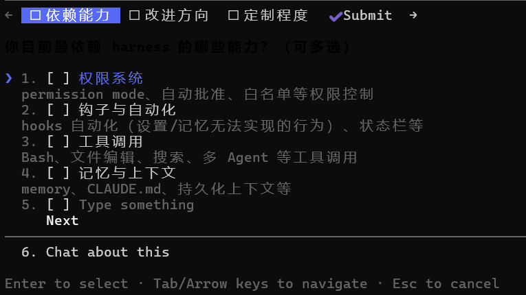
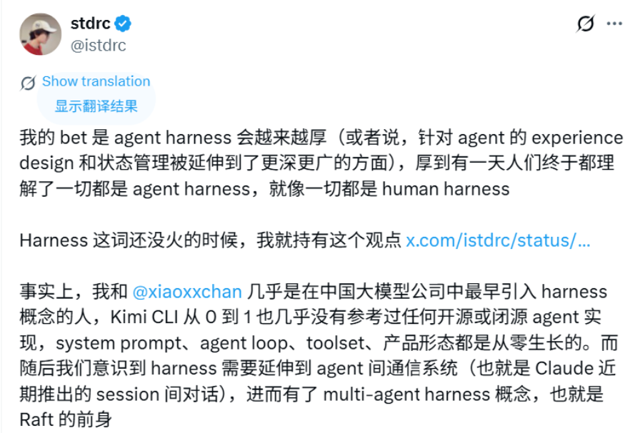
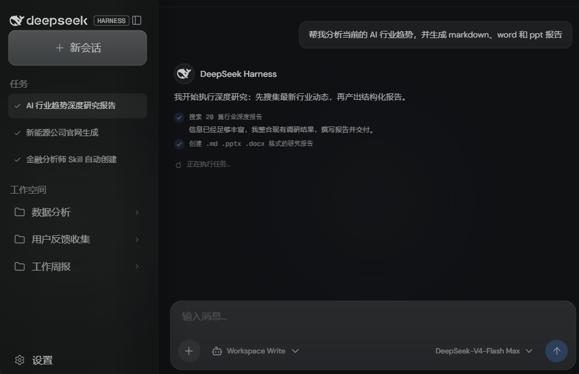

## Harness是什么

工程上的划分一般认为Agent = Model + Harness，《深入理解 AI Agent：设计原理与工程实践》中指出“Agent = LLM + 上下文 + 工具”（Agent的最小工程实现）；可以理解为Harness的最小实现就是 **“上下文+工具”**；而生产级的Harness通常还包括安全约束、验证与纠错等内容。

更确切地说，模型提供智能，**Harness** 提供边界、流程、工具、反馈和治理，包括上下文管理、工具接口、安全约束、验证与纠正等基础设施。
## Harness会被逐步内化成模型的能力？

Rich Sutton曾在19年发表过一篇短文《The Bitter Lesson》，指出**能够充分利用计算能力的通用方法最终会以压倒性优势胜出**，这是过去70年以来在AI研究领域的bitter lesson。

> In computer chess, the methods that defeated the world champion, Kasparov, in 1997, were based on massive, deep search.

1997年击败卡斯帕罗夫的“深蓝”依靠的是大规模深度搜索，而非当时主流的人工知识方法。短期内的“harness”对模型的补强，长期来看都会被模型一点点内化为原生能力。比如工具调用策略，GPT5.6 和Kimi K3都能借助 API 内置工具，在服务端完成reAct编排循环；前者还支持“**自由格式工具调用**”，指GPT-5.6 被训练成在声明了 type: "custom" 的工具上，直接输出原始文本作为参数，而不是硬塞进 JSON字符串（从而不用处理 \\"、\\\n 这类转义），让Harness少了一层 JSON.parse。

还有个我印象很深刻的例子，前两个月在使用Claude Code时，我在没有安装grill-me skill的情况下（虽然matt的grill-me的skill本身就很描述就很简短），模型就会以相同的形式开始发起问卷、质疑我的观点等；这也许跟用户偏好（比如我的某些行为被写进system prompt）有关，但是它展示了一个未来Agent弱skill的可能性——好用的skill会自己集成进大模型里。

Anthropic联合创始人Boris Cherny认为，随着模型能力跃迁，许多外部的Harness能力（如工作流编排、治理控制）会被模型原生吸收，Harness会越来越薄。

油管上还有类似的观点（虽然我找的是B站搬运）：【Fable 5 和 GPT-5.6 不需要更好提示词，需要干净的系统配置】

强模型也许正在脱离对各种特殊工具和skill的依赖，这也是为什么会有“严格的Harness更适合小模型”的声音。

<iframe width="100%" height="468" src="//player.bilibili.com/player.html?bvid=BV1heKE6sEvQ&p=1&autoplay=0" scrolling="no" border="0" frameborder="no" framespacing="0" allowfullscreen="true" &autoplay=0> </iframe>

（原视频链接https://www.youtube.com/watch?v=PDJfciNhyHU）

## Harness反而会变厚？

从前文的理解来看，harness会随着时间推移和模型的训练而被逐渐”吃掉“；我也认同这个方向，但是被吃掉不意味着它会在不远的未来消失。作为一个比较新的概念，Harness本身也在不断进化，各家在为了适配各自的大模型而不断地在打磨相应的harness产品（即使创始人认为Harness正在变薄，A/本家的CC也在不断地变臃肿，前不久还公布了反蒸馏等机制和提示词）

**Raft 创始人 stdrc** 也提到，harness需要延伸到Agent间通信（如Claude Code的session间通话），“进而有了muti-agent harness 概念”，harness自己也在不断地生长。

目前来看，基础的“格式解析”和“简单重试”正在被模型内化（“变薄”的部分），但属于软件工程本身复杂度的部分，并不会因为模型变强而消失——它只会从“补丁”进化为 **“基础设施”**。这是Harness的本质。

Harness工程的原则适用于任何具备推理和工具调用能力的模型；核心是“上下文管理+工具接口”加上三层保障机制：**约束**（限定 Agent 能做什么、不能做什么）、**验证**（检查 Agent 做得对不对）和**纠正**（做错了怎么补救）。

至于会不会变得更厚，我还不能下一个定论；至少长期来看Harness没有完全消失的可能。

## 未来与杂谈

早期的框架主要关注上下文与工具，目的是让它能干事情，不至于因为缺少记忆和工具定义而只会流口水。但生产级的Agent系统的重心需要放在安全相关的约束上，要确保工具的调用是相对安全的、结果是可验证的、错误是可回滚的。
以 ClaudeCode 为例，它的 Harness 中绝大部分代码都是约束、验证与纠正。工具只是一小部分，而围绕这些工具构建的保障机制包括：
- 执行流程的状态管理和追踪
- 上下文压缩；不过这一点我觉得codex做得更好。
- 权限分类器
- 熔断 Circuit Breaker：错误连续发生时停止重试。
- 错误恢复：捕获异常、回滚到上一稳定状态、重试或交还给人类

这一部分才是各家Harness核心竞争力的体现。模型能力越来越同质化，关键区别在于Harness，它负责约束、验证和纠错，保证智能体可靠运行。生产环境中，这类系统代码量最大，远超过模型和工具本身的调用代码。

在成为“基础设施的”路上，DSH也有希望成为一个真正意义上的底座。”一切皆插件“的理念也许代表了harness的未来形态，但是当前还并不成熟。

Pi Agent 也是高度插件化的，两者的真正差别不在插件数量的多少，而在一个问题：扩展坐标由核心预定义，还是可以由插件通过 service/inject 关系持续生成？

> 引用自B站视频【可逆不是逆向运行：DeepSeekHarness的架构分析和论文讲解】
> 
> "Pi Agent本质上是先规定“系统是一个 Agent”，并由核心 Agent Loop 定义主要控制流，然后在 Loop 的生命周期和数据通路上开放扩展点。也就是说，Pi 的扩展空间是 Ext(AgentLoop)：tools、hooks、providers、context 都是 Agent Loop 预先定义好的槽位，插件只能往槽里填。
> 
> 反观DSH，它的扩展空间是 Compose(Plugin₁, …, Pluginₙ)：插件可以 provide 任意服务，其他插件 inject 它——于是新的扩展点不是被核心”设计”出来的，而是被插件生态”涌现”出来的。"

自由度更高是好事还是坏事，可能需要交给时间，这里就不讨论了。

实际使用DSH和PI Agent这类高自由度、可自定义的Agent时，最大的感受就是对LLM本身的要求很高；同样的极简壳子下，调用mimo v2.5和调用GPT5.6 sol的体验差距极大，这也与上面提到的话题有关，能力较弱的模型更需要Harness的强约束和引导。

这类未来式的Harness产品的一个显然的问题是生态灾难：谁都可以写一个插件，用不同的库、不同的错误处理方式。结果就是，我想用DSH时，面临的是10个互相不兼容的“搜索工具”和5套不同的Agent循环逻辑。

不过这种情况在未来应该会有所改善。举个例子：之前DSH刚出的时候，我在Github上寻找TUI插件，虽然确实有很多同类型的轮子，但是一般来说都会选择DSH-TUI：

::github{repo="ccch1mneyyy/dsh-TUI"}

因为有”官方精选“、”社区精选“之类的背书在，重复的轮子会被逐渐淘汰（或者是个人开发者用来学习的玩具），生态灾难会逐渐得到缓解，不会永远处于“无人治理”的状态。

**扯得有点远，但是打了一大段不舍得删，算了。说回Harness：**

当我们讨论Harness会不会消失时，我们讨论的其实是：**未来模型会不会强大到不需要外部“纪律”就能自主完成所有事？** 那样的话也许能实现持续学习，也就有望实现AGI了。

Harness工程很可能只是通往未来更宏大AI系统架构的一个中间形态，它的名字、形式可能还会接着变，但“在模型之外构建一个让其高效、稳定、可控工作的系统层”这个需求本身还将长期存在。
