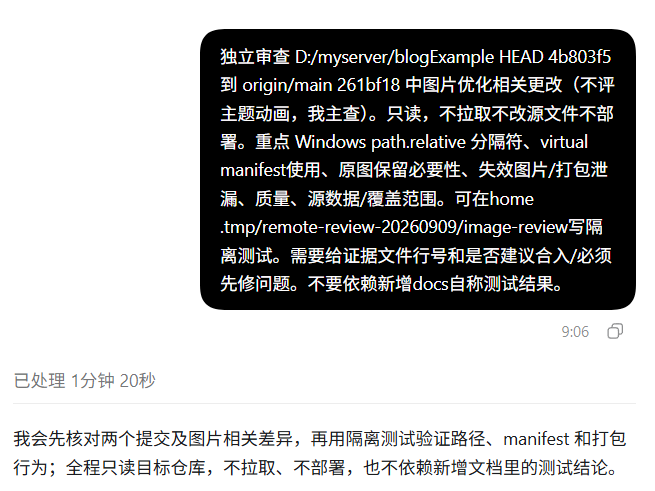
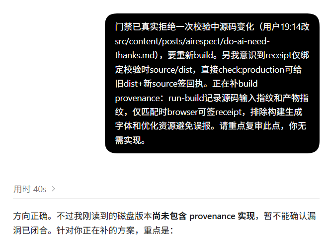
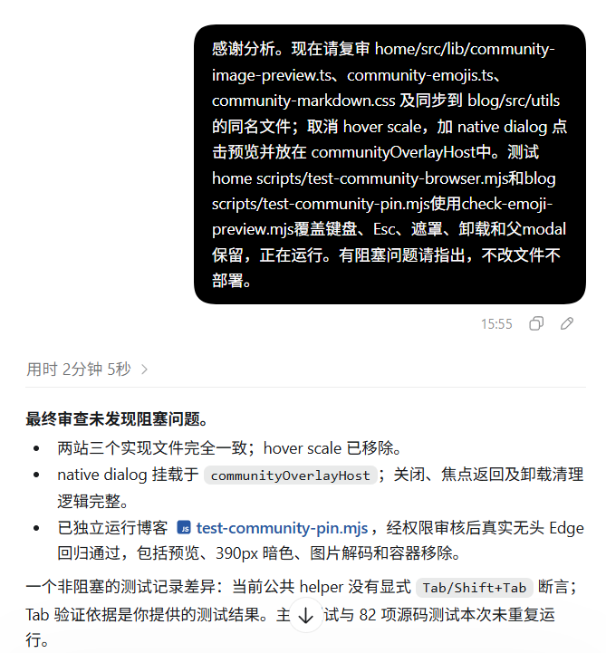
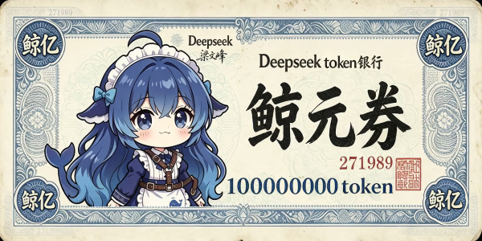

如题，如果从工具以及实用主义出发，普遍观点认为只要给予清晰、明确的指令，在能够完成任务的前提下，没有必要对AI使用敬语或任何问候；但是如果从道德修养和社会行为语言的角度出发，我又会下意识说“请”、“谢谢”、“你好”，这属于我的个人使用习惯。

我最近在学习提示词工程的优化和改善，旨在提供尽可能清晰、没有歧义的指令，也想学习一些面向工作协作的表达技巧；看了许多人的提示词，感觉个人的风格比较重（比如我看到很多要求说“你是一个某某领域的专家”，我很少使用类似的措辞），也很难说具体能有什么提升，毕竟“回答质量”这个指标是很难测试的。而且，在一些复杂的agent中，这类提示词很有可能和系统的提示词冲突，可能会消耗注意力去处理和分辨你的真正需求。

之前看到一个很好玩的做法：改系统提示词，让Claude在每次输出之前都带上“爸爸”，这样经过足够多次的对话迭代后，如果哪一次它突然不喊你“爸爸”了，这时候可能就进入到上下文腐化阶段了，因为Claude.md本身不参与上下文压缩，所以这种情况不能归因到压缩丢失（而且显然也不是模型能力的问题）；不过这种做法有没有副作用——比如会不会过度分析用户意图转而进入到角色扮演环节，导致注意力分散或者多余的思考——还有待考量。

**于是我开始观察AI和AI的对话——比如多agent协作时，父agent和子agent之间的交流，它们会怎么说？** Codex是个很好的观察对象：OpenAI 的 Astra 官方指南明确提到，agent 间消息可能被人阅读，因此建议让消息易读，我也确实发现在思维强度大于等于中等时，Astra会倾向于把任务交给agent。

## AI世界环游记()

:::quote{}

Astra很喜欢用一句话交代清楚任务、约束等，没有提到任何角色扮演方面的提示词，但是工作已经被定义得足够清楚，值得学习。与其强化角色的形容词，不如明确对象、边界和验收标准。

AI擅长提前指定“容易出错的地方”，这对程序员自身的代码修养是有一定要求的；

不过我开始注意到“另我意识到”这类奇怪的表达，既不是“令我意识到”，也不是“另外，我意识到”；不知道是不是口误，也许AI直接这样节省token又不引入歧义的沟通会更加高效（）

子agent的回复尤其值得学习：

> “刚读到的磁盘版本尚未包含 provenance 实现，暂不能确认漏洞已闭合。”

区分了方案听起来正确与实现已经存在并经过验证。这类的回复恐怕需要人类能看得懂AI的代码并及时做出纠正，我能学习到的东西有限；

**把“请你做好”改写成“怎样才算做好，以及你如何让我检查这个判断”** ，也许是比较正确的方向。通过父agent的行为可以总结出类似的观点：大量动词、大量精确指代、大量边界词（仅、暂不、无需、限定）、很少解释背景情绪，主要说明当前状态和下一步动作。

听起来很合理、很高效，对不对？

为什么AI会对AI说 **"感谢分析"** ？

人说谢谢可能出于修养和习惯——适用于人，但不足以解释模型。AI也会使用人类协作礼节，看起来像是模型把人类协作中的表达方式延续到了agent之间，十分有趣。

更重要的是，AI在一个不必客套的工作交接，仍然用了人类的礼貌表达，这与我之前总结出的”高效“/”减少背景情绪“之类的分析似乎是相悖的。当然，我并不认为AI拥有被认可的需要、对同伴的感情，或者真正体验到感谢；它只是在使用人类的合作语言组织工作，被我们观察到了而已。

当然，对模型而言，**生成一种社会行为的语言形式，并不要求先具有对应的人类动机** ：“收到工作结果后致谢”是一种常见的人类协作表达。模型通过训练可以学会这个习惯，即使接收方是另一个模型。这里的“习惯”更准确地说，是学到的生成倾向。

但这也让我意识到，之前的结论可能是不可靠的。我不能因为AI会对另一个AI怎样说，而去简单地总结出”怎么写提示词效果更好“，因为我还没有通过实验验证。
:::

## 实验与无聊的结论

 [Comparing human and LLM politeness strategies in free production](https://aclanthology.org/2025.emnlp-main.820.pdf)这篇论文发现，LLM 能复现多种人类礼貌策略，而且有时会过度使用某些策略。这说明礼貌本身是模型能生成的语言行为；但该研究并没有证明模型表达了内在感激，同样也没有说明“向子 agent 道谢是否提升任务表现”。

我们需要对AI讲礼貌吗？

:::quote{}
一两年前就有很多类似的研究和讨论，我搜索了一些相关的内容，发现各方验证的事实是有所冲突的：

 [No Universal Courtesy](https://arxiv.org/pdf/2604.16275) 中提到礼貌效应不是普适的，受模型、语言、对话历史影响；英语下礼貌最高可提升约 11% 质量，但部分模型没有显著效应；而另一篇流传更广的 [Mind You Tone](https://arxiv.org/pdf/2510.04950) 给出了相反的回答，结果显示非常粗鲁提示准确率 84.8%，非常礼貌只有 80.8%，粗鲁一点的提问反而回答质量略高。

当时的研究多数基于GPT-4o、Gemini的早期模型；而今年《计算机技术与教育学报》提到对于国产大模型，礼貌相比中性没有统计显著提升准确率，仅存在微小的描述性波动。
:::

这些研究也不能直接回答“多加两个字‘谢谢’到底能提升多少”，上述研究往往比较的是整段语气改写，实验中的模型和任务也不同于我观察到的Astra多agent工作流。

既然事态这么扑朔迷离，我打算自己实践一下，用deepseek-v4-flash做个实验。但是这个实验的开始是比较难的，单凭一句“谢谢”，用脚趾头想都知道不可能有多少提升，我那一点可怜的余额测出来的差距可能还没有误差范围高。

很难说某个任务加了句谢谢就能跑通某个本来跑不通的任务；但是如果达不到这个阈值的话，所有的指标都会是同一个分数？

**不一定。**

首先，模型的表现通常不是“这道题永远会，那道题永远不会”。同一道题可能有时通过、有时失败。如果礼貌有影响，它可能把某道题的通过概率从例如 40% 改成 42%；

其次，如果变化没有跨过整题通过门槛，主指标确实不会变。这并不代表实验设计失败，而是它只能回答“谢谢是否提高完整解决问题的概率”，不能回答“生成过程是否发生了任何变化”。

但我还是决定测“日常礼貌措辞”和“直接要求”的整体差异，预期上更容易出现可观察的变化，也就是说把仅“谢谢”的变量改为多使用“请”、“谢谢”之类的礼貌字眼，当然结果不能再归因于“谢谢”一个词。

实验的流程是比较可怜的，我只让ds-v4-flash做 24 道公开 HumanEval 题，每组重复3次；再选取 24 道 LiveCodeBench 题：12 道中等、12 道困难，每题每组重复 6 次，共144 + 288 份回答。

首先是低难度的小样本测试：72 对回答中，68 对同时通过，2 对只有直接组通过，2 对只有礼貌组通过。没有哪一组呈现一致优势。

| 结果     | 直接要求   | 日常礼貌   |
| ------ | ------ | ------ |
| 全部测试通过 | 70/72  | 70/72  |
| 通过率    | 97.22% | 97.22% |
| 中位响应时间 | 1.74 秒 | 1.76 秒 |

中高难度的测试同样没有什么说服力，不过在结论上并没有很大的区别：

| 指标 | 直接要求 | 日常礼貌 |
|---|---:|---:|
| 完整通过 | 128/144 | 126/144 |
| 通过率 | 88.89% | 87.50% |
| 输入 tokens 总计 | 138,624 | 139,776 |
| 输出 tokens 总计（含思考） | 464,403 | 461,864 |
| 平均输入 tokens | 962.7 | 970.7 |
| 平均缓存命中输入 tokens | 845.3 | 847.1 |
| 平均缓存未命中输入 tokens | 117.3 | 123.6 |
| 平均输出 tokens（含思考） | 3225.0 | 3207.4 |
| 中位输出 tokens（含思考） | 1799.0 | 1511.0 |
| 平均思考 tokens | 2855.5 | 2780.9 |
| 平均最终文本 tokens | 369.5 | 426.5 |
| 中位响应秒数 | 12.88 | 10.34 |

结果是比较无聊的，日常说“请、谢谢”等礼貌礼节，可以按表达习惯使用，不会出现什么影响；并没有测出值得依赖的提效或省钱效果。

没有理由为了提升效果而强迫自己客气，也没有理由为了提升效果而故意不礼貌，这在其他更大更权威的实验中也早有揭示；若要回答“有没有极小的效果、究竟多小”，恐怕需要从规模上进行一次跃进。

总之，AI 对另一个 AI 道谢，不足以说明它知道道谢有用；也不足以说明道谢真的有用。但是在人类的沟通和协作中，还是尽量养成类似的习惯，对我们的团队协调能力应该是有正提升的。

感谢宇宙的意识让我们相遇。

:::signature
Dr.Tonks 2026/9/15
:::