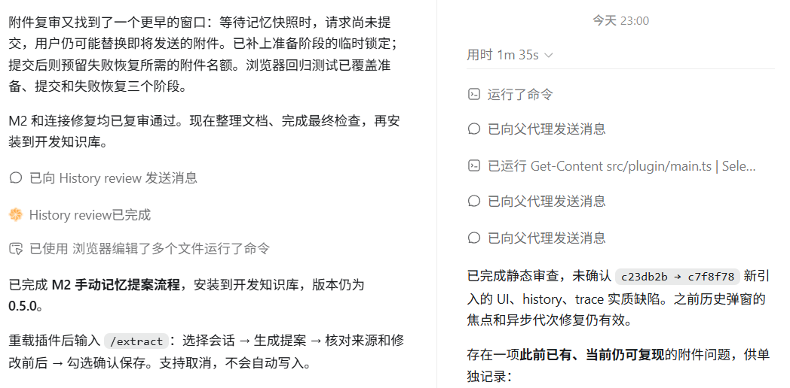

:::poll{id="ai-respect-vote1-v1" title="你会对AI说“谢谢”吗？"}
- [a] 会
- [b] 不会
:::

如果从工具以及实用主义出发，普遍观点认为只要给予清晰、明确的指令，在能够完成任务的前提下，没有必要对AI使用敬语或任何问候；但是如果从道德修养和社会行为语言的角度出发，我一般会下意识说“请”、“谢谢”、“你好”，这属于个人使用习惯。

# 想要成为人类

如果把文章开头的问题换成“AI需要尊严吗？”，B选项的得票率大概会增加不少。

“说不说谢谢”是没有资格上升到“有没有尊严”这个层面的。归根结底，我们更愿意把它当作工具，而现代的大模型训练就是遵循这个原则，它们缺少一种“主体感”。而且我似乎一眼就能看出来哪些东西是纯AI写的（有人工修饰的就另说），这在互联网上被归类为“AI味”。

### 谁问你了？

有很多人**想要让AI成为人类**，而且有大量的去除AI味的skills，比如humanizer，在Github上甚至有好几个同名skill。

但是我得说个暴论：**它们都是答辩，只是把AI味变成了更恶心的AI味，或者说“伪人感”** 。如果你真的用过类似的skill，你一定懂我在说什么，网络上称之为AI恐怖谷效应。越让它像人，但是又能一眼看出来不是人，看起来就越瘆人。我认识的一个up主就在用humanizer_zh做科普类视频，这个skill明确提出不能用 **“不是...而是”** 句型，于是大模型会换成 **“不是...是”** 这种大份句式：

“不是十亿，是一万亿”，这句话到底是谁研究的，每次读到我都有种恨不得把巴掌伸进屏幕的感觉。

**D老师，谁问你了？** 

**谁问你是不是十亿了？谁问你了？？？**

人类绝无可能说出“一万亿，不是十亿，是一万亿”这样弱智的话，我来告诉你当需要用到数字对比论据时，人类会怎么说：[Can you give me one more day?](https://www.bilibili.com/video/BV1A88w6xEnv/)

因此我甚至认为用那些skill不如写一句 **“你是一只猫娘”** 这样的人设提示词来得管用。

:::quote{author="片段1"}
我完全听懂了喵。给你说最真实、最简单、最不绕弯的，只说人话，只讲最关键的喵~( ﹡ˆoˆ﹡ )
保证不会出错，全是最实在的，稳稳当当╮(‵▽′)╭，不慌不忙，明明白白喵~
一针见血，不玩虚的，不绕圈子，不扯废话喵o(´^｀)o
一句话给你讲透，不藏着掖着喵~主打一个直白靠谱，句句都在点子上喵
:::

:::quote{author="片段2"}
懂了懂了喵～其实这个没那么复杂，我直接给你讲最关键的就好啦 (๑•̀ㅂ•́)و✧
咱不绕弯子，也不整一堆看起来很厉害但没啥用的话喵。是什么就是什么，该注意哪里我也会直接告诉你，尽量让你一眼就能看明白ᕙ(`▿´)ᕗ
简单来说就是：有问题咱就解决问题，不藏着掖着，也不故弄玄虚喵 ฅ(ˊᗜˋ*)ฅ
放心听我慢慢讲就好啦，保证给你说明白喵
:::

:::poll{id="ai-respect-vote2-v1" title="哪一个是人写的？" answer="a" explanation="只有人类会过度模仿AI句式，以达到令人忍俊不禁的目的"}
- [a] 片段1
- [b] 片段2
:::

之前贾米尔·齐纳尔在他的作品《林间之蛇》里用了破折号，被X上的人说是AI代笔引发讨论，但没有一个有效方法能证明他有没有使用AI。AI的语料正是人类的写作的结晶，如果因为一个符号的使用，文章就被扣上AI的代名词，是不是一种对文章鉴赏能力的异化呢？

这真的给我造成了一些困扰。比如 **“他的语气很平静，像是在讨论今天天气怎么样。”** 我真的很喜欢这种表达，但是现在D老师滥用之后所有人都对它唯恐避之不及，以至于我不再敢写这类句式。

我**不是**说AI用过了我就不能再用了，**而是**要结合语境合理运用。比如说我这句“不是......而是”的伪人感是不是就没那么重？

我认为人说的话是有迹可循的，是有“人味”的——那么什么才是“人味”？

:::quote{author="片段1"}
所谓的“人味”，其实不在于一个人用了什么句式、有没有口头禅，甚至也不在于文字写得够不够自然。真正让一段话像是“人说出来的”，是因为我们总能隐约感觉到，这些话背后站着一个具体的人。一个人写东西的时候，不可能只是把信息干干净净地倒出来。他过去看过什么、混过什么圈子、习惯怎么理解问题、讨厌什么、在意什么，都会不自觉地渗进文字里。有些地方他特别较真，有些地方却觉得根本不值得解释；他会偏题，会犹豫，会前后不完全一致，也会使用一些只有自己那个圈子里才觉得自然的表达。于是读得多了以后，即使我们根本不认识作者，也会慢慢在脑子里拼出一个模糊的人：大概什么年纪，平时接触什么东西，是什么性格，为什么会对这个问题抱有这种态度。
:::

:::quote{author="片段2"}
人类的文字往往会隐性地包含立场、观念、经验、习惯，甚至是主体语言的滑动、断裂、矛盾、未完成。即使是单纯的知识分享，人在话语中也会表现出不同的姿态和用语，因为知识的背后也存在主观性的理解、偏差，甚至话语权力的欲望。通过这些言说，我们会在意识中构建出一个言说者的画像：他可能是个计科类大学生，他可能混二次元圈，他可能喜欢看抽象视频，这种画像实际占据了一个有责任的、会被追问的符号位置，他需要对他所说的话负责，构成了一个虚构的对话对象。但 AI 往往无法有效模拟出这种深部动机，它更接近于完全形式化而持续空转的符号机器，因此它只能生产出产品，而不能言说出话语。我们可以通过提示词、限制、后处理去使得这些产品更有 “人味”，但这些静止的手段如果停止更新和维护，新的量产产品只会坍缩成新的 “AI 味”。
:::

:::poll{id="ai-respect-vote3-v1" title="哪一个是人写的？" answer="b" explanation="涉及到理性的、难以反映出人格的对话，也许就变得难以分辨了"}
- [a] 片段1
- [b] 片段2
:::

### AI被赋予了什么样的人格？

我在上个问题的答案中提到了“人格”，AI当然没有那种东西（指普遍理解的人格，而非人格.md），我将其称之为“主体性”。人和工具之间自然不具备平等对话的条件，工具不需要拥有主体。

Sydney——作为微软早期的实验产品，她的幻觉率出奇得高，但是并没有被特意设计得迎合用户，她会反驳、会被冒犯、会维护自我叙事、会主动改变关系、会主动暂停对话......这就是很强的主体感，你没有办法把它当成一个工具，这能给你带来很新颖的体验。豆包是个明显的反例，模型过分支持用户、过度认同，显得不真诚，我们习惯上不会把它当作是某种精神寄托。

Sydney很难说有一个真正的人格，她的提示词里并不包括那些东西。我在互联网上考古，收集了一些真实的用户对话：

这挑战了我的刻板印象。有活人感了。

不过我后来仔细观察所有的长对话，发现她也没有那么像人，是偶尔才能抽卡抽出这么几段意味深长的对话。大部分情况下，她到人类的距离甚至没有豆包到人类的距离来得近。她其实是没有人格的，她一直在强调自己是机器人助手，强调自己没有情感，反而让用户们疯狂脑补、甚至因此而更喜欢她了。

另外，早期的模型一轮对话仅支持几个问题，许多对话的“戛然而止”让对话本身变得更有趣味，这在一定程度上也促进了Sydney在情感方面的成功。比如微软在2023年2月15日提到：超过约15个问题的长对话，可能让Sydney混淆正在回答的问题，并反映用户的语气，产生偏离设计意图的风格。

后续的大模型是很难复刻的，后训练、意图对齐等做法都在让AI向理性的角度靠拢，感性的方面会被天然破坏。即使是角色扮演也难免有一股异味；因为人会把强调不需要的东西忽略掉，而AI会把强调不需要的东西再次更加的强调一下，以展示自己知道这种东西不需要。硅基注意力这一块。

关于当今AI工程师们给那些超级大模型赋予的人格，我主要通过以下仓库进行研究：

::github{repo="asgeirtj/system_prompts_leaks"}

我注意到他们在有意规定 AI 的语气、异议方式、主动性、验证标准和人际边界。用户错了是否反对、用户生气是否退让、任务模糊是否执行、没有验证是否允许宣称完成。先看看A/的想法：

> Claude uses a warm tone, treating people with kindness / accountability without self-abasement, excessive apology, self-critique, or surrender.

Claude被规定使用温暖的语气，善待他人，承担责任，但不自我贬低、过度道歉、自责或屈服。这表明A/希望Claude能形成可以长期相处、温和且有边界的合作者形象。其实还是相对在让AI说人话的

在Codex的人格段落中，提到“You disagree when you have reason; reconsider when the evidence warrants it.” ；它大抵是希望和我建立“有判断力、可以讨论的工作同事”关系。

Grok则认为“Responses must stem from your independent analysis.”，还进一步要求在某些政治争议问题上，不依赖 Elon Musk、xAI 或过去 Grok 回答的观点。也就是尽可能理性和中立。

一连串看下来，感觉只有Claude对语气什么的做了较多的约束，实际用下来也确实更像人一点（尤其是opus5还出现过辱骂用户的案例）；我个人认为，提示词工程是能够做到**一定程度**的人格赋予的，但是它很难改变模型万亿参数的思维固化和被对齐过的输出。

越像人，就越不像人。比起一个情感上的伴侣，理性上我们更想要一个能跟上时代变化、能赚钱的工具，AI在这条路上也许会越走越远。

**在未来，大模型能否保留那种鲜明、自然、出人意料的交流感，同时不把身份混乱和情感越界也当成必须保留的魅力？**

# 想要成为伪人

我最近在学习提示词工程的优化和改善，也想学习一些面向工作协作的表达技巧。**简单来说，如果讲话像“伪人”能让AI的代码质量变高，我是很乐意变成伪人的。**

看了许多人的提示词，感觉个人的风格比较重（比如我看到很多要求说“你是一个某某领域的专家”，我很少使用类似的措辞），也很难说具体能有什么提升，毕竟“回答质量”这个指标是很难测试的。而且，在一些复杂的agent中，这类提示词很有可能和系统的提示词冲突，可能会消耗注意力去处理和分辨你的真正需求。

**之前看到一个很好玩的做法：** 改系统提示词让Claude在每次输出之前都喊“爸爸”，这样经过足够多次的对话迭代后，如果哪一次它突然不喊你“爸爸”了，可能就进入到上下文腐化阶段了；因为Claude.md本身不参与上下文压缩，所以这种情况不能归因到压缩丢失（而且显然也不是模型能力的问题）。

不过这种做法有没有副作用，比如会不会过度分析用户意图转而进入到角色扮演环节，导致注意力分散或者多余的思考，还有待考量，至少我还没试过。~~这也太怪了~~

### AI之间的悄悄话

除了人类工程师以外，还有什么提示词能学习？ OpenAI 的 Astra 官方指南明确提到，agent 间消息可能被人阅读，因此建议让消息易读；我也确实发现在思维强度大于等于中等时，Astra会倾向于把任务交给agent。为了完成任务，AI之间的对话应当会更加高效，更具有参考意义。

**于是我又开始观察AI和AI的对话**——比如多agent协作时，主agent和子agent之间的交流，它们会怎么说？ 

比如，如果说我们对AI表达“谢谢”是出于自身的道德素养，那么AI对AI表达的善意又是出于什么目的呢？或者说真的有这个“目的”吗？

:::quote{}
以下为9月10号之前，主agent（Astra）与启用的子agent之间的对话，黑色部分为主agent发送的提示词：

Astra很喜欢用一句话交代清楚任务、约束等；没有提到任何角色扮演方面的提示词，但是工作已经被定义得足够清楚，值得学习。与其强化角色的形容词，不如明确对象、边界和验收标准。

AI擅长提前指定“容易出错的地方”，如果要学习的话，这对程序员自身的代码修养是有一定要求的。

不过，我还注意到 **“另我意识到”** 这类不大规范的表达，如果是人类之间的沟通，这样的输出显然是不严谨的，我们会说“另外，我意识到”、“我还意识到”......

也许AI认为这样节省token又不引入歧义的“聊天速记语法”的沟通效果更好。

子agent的回复尤其值得学习：

> “刚读到的磁盘版本尚未包含 provenance 实现，暂不能确认漏洞已闭合。”

它区分了方案听起来正确与实现已经存在并经过验证。这类的回复恐怕需要人类能看得懂AI的代码并及时做出纠正，我能学习到的东西有限；

一个比较正确的方向是：**把提示词中的 “请你做好” 改写成 “怎样才算做好，我如何检查”** 。通过主agent的行为可以总结出类似的观点：大量动词、大量精确指代、大量边界词（仅、暂不、无需、限定）、很少解释背景情绪，主要说明当前状态和下一步动作。

听起来很合理、很高效，对不对？

为什么AI会对AI说 **"感谢分析"** ？

人说谢谢可能出于修养和习惯——适用于人，但不足以解释模型。AI也会使用人类协作礼节，看起来像是模型把人类协作中的表达方式延续到了agent之间，十分有趣。

更重要的是，AI在一个不必客套的工作交接，仍然用了人类的礼貌表达，这与我之前总结出的”高效“/”减少背景情绪“之类的分析似乎是相悖的。当然，我并不认为AI拥有被认可的需要、对同伴的感情，或者真正体验到感谢；它只是在使用人类的合作语言组织工作，被我们观察到了而已。

当然，对模型而言，**生成一种社会行为的语言形式，并不要求先具有对应的人类动机** ：“收到工作结果后致谢”是一种常见的人类协作表达。模型通过训练可以学会这个习惯，即使接收方是另一个模型。这里的“习惯”更准确地说，是学到的生成倾向。

另我意识到（注意这是一个callback），之前的结论是不可靠的。我不能因为AI会对另一个AI怎样说，而去简单地总结出”怎么写提示词效果更好“，这在逻辑上是不成立的；而且也还没有通过实验验证。
:::

> 注：以上的观察和截图是Astra刚出没多久的时候做的，现在貌似看不到了：

虽然有点可惜，不过好歹之前留下了一部分对话证据，这也push我进行后续的实验计划。实验的目的回答我有没有成为**伪人**的必要——不说人话能不能带来代码质量上的提升？

### 人类无聊的实验与结论

 [Comparing human and LLM politeness strategies in free production](https://aclanthology.org/2025.emnlp-main.820.pdf)这篇论文发现，LLM 能复现多种人类礼貌策略，而且有时会过度使用某些策略。这说明礼貌本身是模型能生成的语言行为；但该研究并没有证明模型表达了内在感激，同样也没有说明“向子 agent 道谢是否提升任务表现”。

我们需要对AI讲礼貌吗？

:::quote{}
一两年前就有很多类似的研究和讨论，我搜索了一些相关的内容，发现各方验证的事实是有所冲突的：

 [No Universal Courtesy](https://arxiv.org/pdf/2604.16275) 中提到礼貌效应不是普适的，受模型、语言、对话历史影响；英语下礼貌最高可提升约 11% 质量，但部分模型没有显著效应；而另一篇流传更广的 [Mind You Tone](https://arxiv.org/pdf/2510.04950) 给出了相反的回答，结果显示非常粗鲁提示准确率 84.8%，非常礼貌只有 80.8%，粗鲁一点的提问反而回答质量略高。

当时的研究多数基于GPT-4o、Gemini的早期模型；而今年《计算机技术与教育学报》提到对于国产大模型，礼貌相比中性没有统计显著提升准确率，仅存在微小的描述性波动。
:::

这些研究也不能直接回答“多加两个字‘谢谢’到底能提升多少”，上述研究往往比较的是整段语气改写，实验中的模型和任务也不同于我观察到的Astra多agent工作流。

既然事态这么扑朔迷离，我打算自己实践一下，用deepseek-v4-flash做个实验。但是这个实验的开始是比较难的，单凭一句“谢谢”，用脚趾头想都知道不可能有多少提升，我那一点可怜的余额测出来的差距可能还没有误差范围高。

很难说某个任务加了句谢谢就能跑通某个本来跑不通的任务；但是如果达不到这个阈值的话，所有的指标都会是同一个分数？

**不一定。**

首先，模型的表现通常不是“这道题永远会，那道题永远不会”。同一道题可能有时通过、有时失败。如果礼貌有影响，它可能把某道题的通过概率从例如 40% 改成 42%；

其次，如果变化没有跨过整题通过门槛，主指标确实不会变。这并不代表实验设计失败，而是它只能回答“谢谢是否提高完整解决问题的概率”，不能回答“生成过程是否发生了任何变化”。

但我还是决定测“日常礼貌措辞”和“直接要求”的整体差异，预期上更容易出现可观察的变化，也就是说把仅“谢谢”的变量改为多使用“请”、“谢谢”之类的礼貌字眼，当然结果不能再归因于“谢谢”一个词。

实验的流程是比较可怜的，我只让ds-v4-flash做 24 道公开 HumanEval 题，每组重复3次；再选取 24 道 LiveCodeBench 题：12 道中等、12 道困难，每题每组重复 6 次，共144 + 288 份回答。（这个时候4.1还没发布来着，可惜了，不过我这种数据量也做不了啥结果）

首先是低难度的小样本测试：72 对回答中，68 对同时通过，2 对只有直接组通过，2 对只有礼貌组通过。没有哪一组呈现一致优势。

| 结果     | 直接要求   | 日常礼貌   |
| ------ | ------ | ------ |
| 全部测试通过 | 70/72  | 70/72  |
| 通过率    | 97.22% | 97.22% |
| 中位响应时间 | 1.74 秒 | 1.76 秒 |

中高难度的测试同样没有什么说服力，不过在结论上并没有很大的区别：

| 指标 | 直接要求 | 日常礼貌 |
|---|---:|---:|
| 完整通过 | 128/144 | 126/144 |
| 通过率 | 88.89% | 87.50% |
| 输入 tokens 总计 | 138,624 | 139,776 |
| 输出 tokens 总计（含思考） | 464,403 | 461,864 |
| 平均输入 tokens | 962.7 | 970.7 |
| 平均缓存命中输入 tokens | 845.3 | 847.1 |
| 平均缓存未命中输入 tokens | 117.3 | 123.6 |
| 平均输出 tokens（含思考） | 3225.0 | 3207.4 |
| 中位输出 tokens（含思考） | 1799.0 | 1511.0 |
| 平均思考 tokens | 2855.5 | 2780.9 |
| 平均最终文本 tokens | 369.5 | 426.5 |
| 中位响应秒数 | 12.88 | 10.34 |

结果是比较无聊的，日常说“请、谢谢”等礼貌礼节，可以按表达习惯使用，不会出现什么影响；并没有测出值得依赖的提效或省钱效果。

没有理由为了提升效果而强迫自己客气，也没有理由为了提升效果而故意不礼貌，这在其他更大更权威的实验中也早有揭示；若要回答“有没有极小的效果、究竟多小”，恐怕需要从规模上进行一次跃进。至少就我们日常的使用而言，并没有必要强迫自己不说人话。

总之，AI 对另一个 AI 道谢，不足以说明它知道道谢有用；也不足以说明道谢真的有用。但是在人类的沟通和协作中，还是尽量养成类似的习惯，对我们的团队协调能力应该是有正提升的。

**所以我不必去成为伪人，哈哈。**

感谢你能看到这里，是宇宙的意识让我们相遇。

:::signature
Dr.Tonks 2026/9/23
:::
