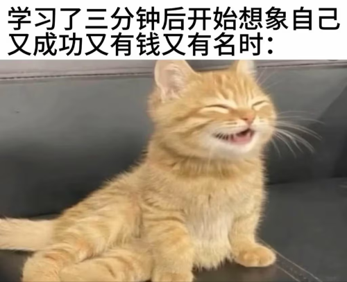
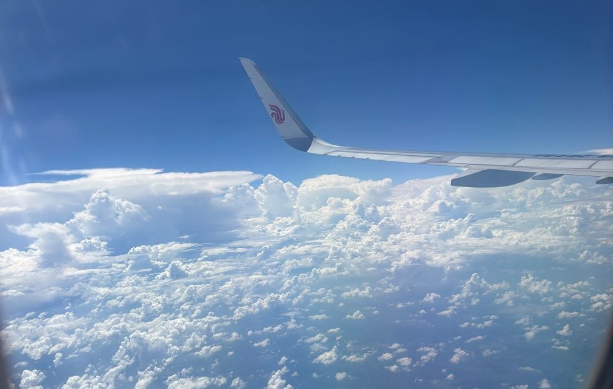
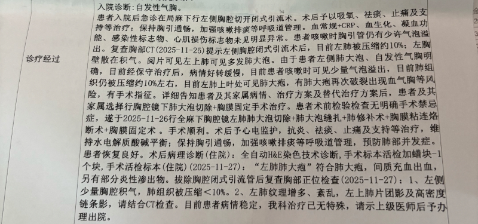
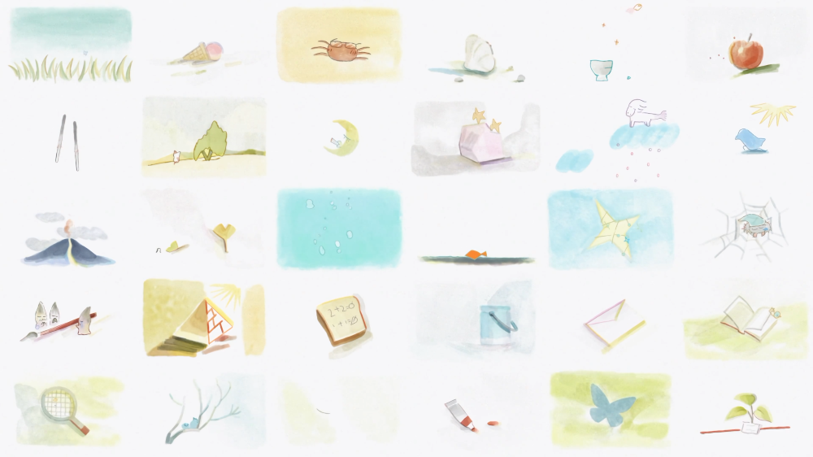

我想记下点什么，但是生活的节奏太快，我经常抓不住它们。这学期的压力比较小，为了填掉之前同学给我的推荐，忙里偷闲看了《献给阿尔吉侬的花束》[^1]、《四月间事》[^2]和《记忆管理局》[^3]，短时间内大概不会再去看其他东西了，后劲比较大。

借着这个空档，我开始整理思绪；我发现有些很久远的记忆碎片已经消失了，可我分明记得它原本在我脑海中的位置，这种感觉令我相当难受。

虽然下学期要一边忙推免相关的事一边实习（其实我本打算从11月就开始找实习，奈何1月才考试）；上半学期没什么比赛可打，但是可以提前准备一些东西，尤其是了解企业实习/科研实习之类的方向；看着同学们忙忙碌碌东奔西跑，我还是不免有些焦虑的。

但是我怕再不写点什么就忘记了；思来想去，就在这里拼拼凑凑，不知不觉写了许多。
## “这些明明都很有意义啊”

有一次和我姐姐一起骑着自行车去田里轧小蜈蚣，把自己想象成为民除害的英雄；下雨了就把车停在路边，自己跑到附近的棚子里避雨；以前在乡里到处逛，脑子里跟有地图似的，现在只有个模糊的记忆，走到哪都会迷路。后来那辆自行车生了锈，连我弟都看不上了，吵着要买辆新的；

有一次骑车溜达完，回家看到路边的小黑狗，兴奋地把它抱起来想带回家里，结果被它的牙齿划到了，一度以为自己要得狂犬病死了（因为当时在网上搜的结果都是一旦发作就死定了），又不敢跟家里人说，于是一整周都郁郁寡欢，奶奶还以为我被鬼上身了；其实过了段时间就忘记有这回事了，然后该怎么玩还是怎么玩，只是再也没看见过那只小黑狗了，这不是什么好事，我家附近有很多狗贩子，但愿是它找到主人了。

有一次回老家摘枇杷，外婆抓了只小鸟（是麻雀吧？我记得应该是麻雀，但是麻雀怎么能抓得到呢？？？） ，捧在手里要给我看，我当时特别好奇，甚至想上手摸摸，结果我妈妈说“把它放了吧，它也有妈妈，它的妈妈会担心它的”。细节记不清了，总之是类似的话。我只能遗憾地让外婆把它放飞了，我说它很可爱，我想看它飞，想看它和它妈妈在一起。

我当时以为外婆脸上会是扫兴的，因此不敢抬头看她。后来上了初中，两家的联系变少了，就没什么机会看到了。**我好想再看一次啊。我好久没再看过她的脸了。**

有一次，有一次......

我的童年经历应该是很丰富的，我总是能随口讲出“有一次”。直到某天我突然意识到那些都是最后一次。我清楚我再也回不到过去了。但这些记忆碎片很珍贵，很有意义；即使到了现在，我也从不觉得小时候骑车压过一只又一只蜈蚣是在浪费时间。
## “记忆这样脆弱的东西”

回忆中的家里总是很温馨的，乡下的生活总是很快乐的。这显然有些过度美化了，我开始思考它们的反面。

其实我很讨厌在家里过年过节，我讨厌看到我不认识的亲戚在家里走来走去，问我的成绩，问我记不记得小时候被谁抱过。所以我后来也没那么经常骑着车出去逛，我总是怕遇到那些人。

其实我很早就没有再跟姐姐出去玩过了，她上高中后，她上大学后，她开始工作后......暑假的时候她哭着和妈妈说“待不下去了”，大概工作上有了什么难处；我听说是她最近胸口比较闷，也不好意思开口问，毕竟她也没跟我说。我们好像越来越陌生了，我打开她的微信，一句慰问的话怎么也发不出去，看到最近的聊天是在一年前，好像亲情的联系也没有我想象中的那么紧密。我恨我的矫情。

**今年我的外婆走了，走得很突然；我妈妈平时很喜欢用语音，那天告诉我的时候也不发了，我知道是怕语音能听出哭腔。**

我放下手机，用手掐自己的脸，强迫自己2分钟不眨眼，企图挤出两滴泪水，但是最终也没有哭出来。我谴责自己是个**冷血动物**。我回忆起外婆的脸，才发现这张脸在我的脑海里已经很久没有更新过了，我在手机里翻了半天也找不出一张照片。

**我好像没有那么喜欢那个村子，我好像也没有那么爱我的外婆。** 那些都是记忆美化出来的结果，那个在福清的小村子在我的记忆里被美化了10年。我不该相信记忆这么脆弱的东西，它们都会被时间摧毁的。

我把外婆的死讯告诉了当时我认为最亲近的人，然后面无表情地在手机里打出 **“我没有外婆了，我好想哭”** 。

点击发送前，我想起了我妈。于是我又一字一字删掉了；每删一个字，我妈妈的身影在面前就更真切一分。最后她好像真的出现在我的面前。她看着我说：:spoiler[**“你不要继续假装悲伤了。”**]

这句话实在听着伤人，我知道她不会这么说的。就算我真的对我的外婆没有感情，她也不会责怪我的——那她会怎么说呢？

手机屏幕忽然“叮”地亮起来，我妈好像真的给我发消息了，可我怎么也看不清，我拼命地揉眼睛，才发觉眼泪砸在桌面上。鼻子被什么东西堵住了，眼镜摘了又戴，可我怎么也辨认不出那些字。

:spoiler[**我又想起那个夏天，枇杷罐冰冰凉凉贴着我的小脸，我看到外婆神秘兮兮地走来，把双手捧到我面前，忽地张开，手心里探出一个毛茸茸的鸟头来，叽叽喳喳，很乖地点着头。**]

我的视线突然变得清晰起来，我又想起她的模样。我盯着手机看，直到熄屏。

:spoiler[我妈妈说的是 **“我没有妈妈了，我好想哭”** 。]

人也很脆弱，人比记忆脆弱得多。我从那时候起才意识到这样的离别有多么令人难以接受。
## “死亡随时都有可能到来，而且不讲道理”

被幼犬的牙齿划伤的那段时间是我思考人生最长的日子，我想人为什么会活着，为什么随随便便就要死了；我用了相当长的时间说服自己死不可怕，这可能对我以后的人生态度产生了巨大的影响。它把我变成了一个”主观唯心主义“的人。

Solipsism？我不确定这个词合不合适。

**某天走在地铁进站口的边上，和工作室的朋友探讨坐飞机。** 

她问我：”你怕不怕飞机失事？“

**“这有什么好怕的？”**

“概率是很低，但是你不觉得很可怕吗？你不买保险吗？”

**“不是概率的事；我的意思是就算发生了也没什么好怕的。反正就一瞬间的事情。”**
> 其实如果真的发生了我大概会先和其他乘客一样慌乱，只不过我已经提前做了10年的心理准备，接受自己的死亡并不是件难事。

"?"

"不是，你死了，那你家里人怎么办？"

**“其实只要不会变成幽灵一直游荡，就不会在乎吧；你想，这个世界因为你的感知而存在，如果你死了，再也感知不到其他人，又为什么会担心死后的事情？”**

这大概就是所谓的“唯我论”；我无意中提出“存在就是被感知”这样的观点后，还认识到了贝克莱主观唯心，当然他大逆不道地引入上帝作为永恒感知者，我是不信的；所有的宗教都不应该试图向我灌输或者干涉我的精神活动。不过至少在去掉上帝的部分，我和贝克莱达成了一致，我也算是半个哲学家了hhh。

去年我气胸压缩70%的时候没有立即去医院，先试试顶着压力上了一上午的课，当然我后来实在扛不住了。打车去医院的路上我在想我是不是快死了；做完CT，因为没有挂急诊优先通道，等报告的时候我就在附近闲逛。护士拿着手机过来的时候很惊讶，说你肺都压缩到70%了，怎么还能走来走去，我不知道70%是什么概念，吓了一跳；听医生说一定要做手术的时候两眼一黑，仿佛才感知到疼痛，马上就半死不活、瘫坐在椅子上了。

这回我没有践行 **“身后事皆无意义”** 的理念，而是拿出手机给家人和朋友发送了我将要做手术的讯息，提前打个预防针。**开什么玩笑，这只是个小手术，我还是有活下来的风险的。** 

医生的表情很耐人寻味，他说你怎么一个人就来动手术？我没回答他。躺倒手术台上的时候，我又有了 **“坐飞机”** 的觉悟了。10年以前的我会很害怕，现在觉得就这么走了也挺好了。当然最后还是没死成。做完手术痛不欲生，我觉得不带痛苦地死去还是太难了。

**别误会，我不主动寻死。** 我只是在可能的意外到来之前自我释怀，我不觉得这是”自毁倾向“。我总是想世界就这样毁灭吧，这应该是”灭世倾向“。**我觉得正常人很难不产生这种倾向。**

所谓世界末日的倒计时其实是我生命的倒计时。

**世界毁灭的原因也不过是一条小鱼跳出了鱼缸。**

## “去寻找那些闪闪发亮的东西”

《记忆管理局》里描述了一个情节：大发明家对他的造物说，**“去寻找那些闪闪发亮的东西吧”**，机器人从此开始了漫长的寻找，慢慢了解艺术、了解生活，最后才想明白发明家的意思其实是为了让它在寻找的过程中学会生活，学会追寻自我。

其实跟史铁生写的故事很像：两个盲人师徒，靠弹三弦说书谋生。 老瞎子的师父告诉他：只要弹断一千根琴弦，就可以取出琴槽里藏着的药方，吃药就能重见光明。这句话支撑老瞎子活了整整五十年，翻山越岭、四处说书，一根一根弹断琴弦。等到他终于弹断第一千根，满心欢喜取出药方，才发现那只是一张白纸，什么字都没有，世上根本没有治眼盲的药。

药方本身是假的，但是 “要弹断一千根琴弦” 这个目标，让他在余生里认真地活着。

> “人的命就像这琴弦，拉紧了才能弹好，弹好了就够了。目的虽是虚设的，可非得有不行，不然琴弦怎么拉紧。” ——史铁生《命若琴弦》

尾鱼还有一本书《司藤》我也很喜欢。女主角有句话让我印象非常深刻：***人活着，总要有个目标，有个奔头，连小学生的作文都在写：《我的梦想》。你的梦想是什么？***
> 可惜那本书不在身边，一想到它我就想要重温一下；它曾是陪伴了我整个高中的读物

但我的思维方式注定了我没什么能量去追寻那些闪闪发亮的东西。我最希望的就是我的人生不要出现什么变故，一辈子风平浪静，永远躺在舒适区里；但这毕竟不是我能控制的，谈不上什么梦想。

我曾经有过的最大的梦想（或者说是幻想）就是能带着我的灵魂回到小时候，可一想到我要再次面对一次高中生活，就没办法继续幻想下去了。我当然很怀念，但是老兵怀念的是战友，不是战场。

我虽然没有那么多激情了，但是我还是能够做点什么的；我没有机器人那么漫长的生命，却也有资格去寻找那些闪闪发亮的东西，提早认识到这一点也不至于像老瞎子一样到最后才醒悟过来自己都做了什么，那样反而比较可悲。

如果你意识到了这一点，你就应当稍微拥有一些对生活和对自我的激情，即使你和我一样没什么动力、没什么梦想，至少也有了把日子过好的勇气，之后再谈那些“闪闪发亮的事情”。

## 题外话

这大概本来是一篇《记忆管理局》的观后感吧，《献给阿尔吉侬的花束》更多地是在探讨哲学，没有那么多能共情的部分，《四月间事》对我来说太宏大了，当然也很震撼，但是以我肚子里那点墨水恐怕没资格做出点评。

于是我朝着《记忆管理局》观后感的方向落笔；然而我写完之后发现写的东西好像跟剧情关系不大，更像是随笔？后知后觉，于是加急补了一段**题外话**（其实是题内话吧喂），没有剧透警告。

从2020年的短片开始关注，到1年前刷到它的相关pv，我从来都没有意识到它会给我带来一个怎样震撼的体验。剧情的话应该算是低开高走，如果不是因为20年研究过相关设定，我大概也会被前4集劝退的，但是话又说回来了，后3集确实把观感带到了一个前所未有的高度，以至于我会下意识忽略掉前几集意义不明的内容。《记忆管理局》讨论了很多深刻的话题，家庭、学习、社会、生死、记忆、追寻自我；我感触最深的大概还是珍惜当下。

感谢你能看到这里。

感谢宇宙的意志让我们相遇。

[^1]: 《献给阿尔吉侬的花束》是美国作家丹尼尔·凯斯创作的科幻小说，以查理的“进步报告”探讨了智慧与人性、自我认知与孤独的深刻主题，在全球拥有超过600万册销量和30多种语言译本，并多次被改编为电影、舞台剧和日剧。

[^2]: 《四月间事》是中国网络文学作家尾鱼创作的一部悬疑小说，将残酷的历史背景与个人命运交织，在悬疑、冒险与爱情的外壳下，探讨了关于守护、真相与人性抉择的沉重主题。

[^3]: 《记忆管理局》是一部由**火药方糖**、**摔跤社**联合开发的国创二维原创动画作品，孵化自2020年广受好评的18分钟同名短片，其画面融合了**复古像素风、黑白漫画分镜、水彩绘本**等多种风格，以其独特的线条运用和极具张力的作画著称。
