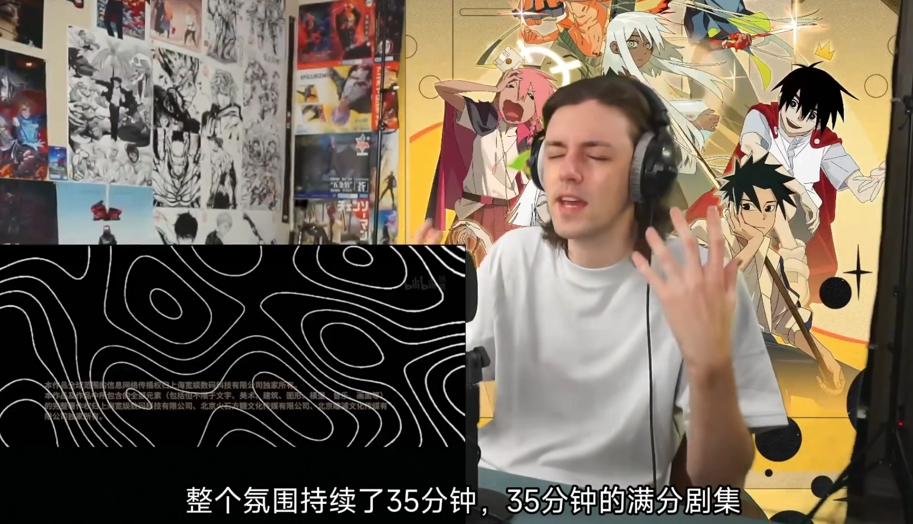
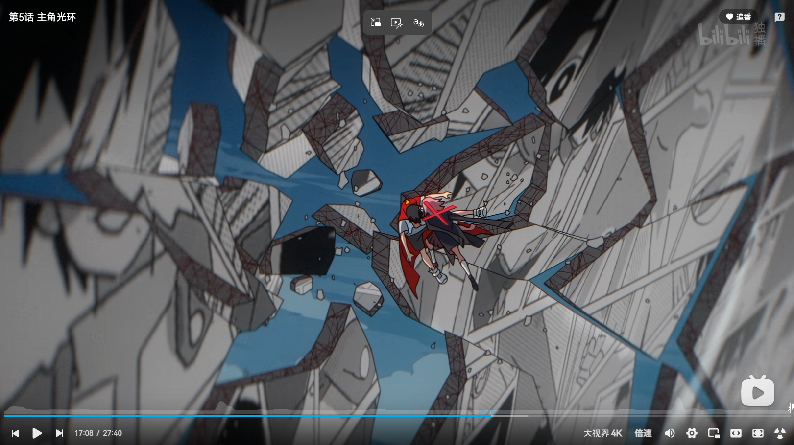

> 方糖太美了www

## 剧情之外

《记忆管理局》这是个好故事，但创作者们也许没有把故事讲好。初看之下会以为是意识流，看到后来会发现是不可靠叙事，其实我给这部的评价很高，但综合看下来制作组确实是需要做点减法。

可能是受限于篇幅，故事讲完了但是坑并没有填完，作为一个只有7集的中篇动漫，很多契诃夫的枪到最后也没能打响。比如：

**猫笼子到底是什么？**

到最后也没有说，大概是想让我自己对电波吧。

可能有人要问：**你怎么既说“需要做点减法”，又说“篇幅受限”，那到底是该加还是该减啊？**

制作组选择了一个极其复杂的世界观去讲述一个很简单的故事，自然会引出这个矛盾；要么就少画点乱七八糟的意象，要么就多画几集去讲清楚这些乱七八糟的意象，但是这部番有点卡在中间的意思了。我的建议是中篇还是尽量把主线捋清楚了，可以删减一部分影响观感的炫技和世界观补充。猫笼子、灰火等跟主线关系不大的设定完全可以放在官方幕后设定集里，不应该分走任何叙事资源。

当然那些**没起到作用的伏笔**也许是所谓的第二季的展望，但是第一季做了这么多年，最后也没有多火，我很难相信制作组有那个热情出第二季。

继续讨论剧情之前，还得提一嘴配菜：《忘记了也没关系》给我听出走马灯了，一整曲都洋溢着好热烈的青春和生命力，妙不可言。

> This is true art. Be Like：

虽然配乐和作画都是顶级，但是配音我真的得单独拿出来说一下

**真的太烂了**

这样一个矛盾爆发的顶点、怒火滔天的情绪铺垫、充满张力的画面表现时刻，“哼哼”两声就糊弄过去了，如果去掉霰弹枪换弹/开枪的音效，这段简直可以说是拉完了。还有后面的关潮“我要回到属于我的现实”——多好的找到人生目标、重新振作的台词啊，怎么才能配得像死了三天的咸鱼？

**死亡随时都有可能到来，而且不讲道理；**

就像最后一集里，世界毁灭的原因也不过是一条小鱼跳出了鱼缸。