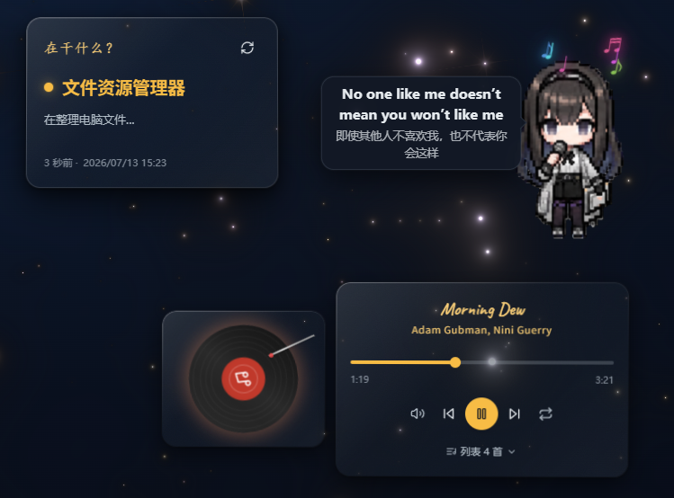

# 音乐系统概述

我的[个人网站](https://tonks.top/)在重构后上线了桌宠系统（老普，立绘来源于claude-code-but-prts项目，有进行二次创作）、一个音乐播放器和音频可视化组件，整合了 LRC 歌词解析、Canvas 环形频谱可视化、老普跟唱伴舞，以及背景的音频律动模式。

项目地址：

::github{repo="/DrTonks/tonks-home"}

其实最开始只是为了给老普配个气泡框，让她能说说话什么的；后来觉得只是日常触发点句子有点浪费这个系统了，就想那她能不能唱歌呢？

所以我和老普一商量，改了下播放器的上传功能，让它支持向后端上传LRC歌词，不传则默认为纯音乐。

**LRC从哪里来？**

感谢jitwxs等开发者提供的云音乐歌词获取处理工具，这个伟大的项目：

-  支持网易云音乐、QQ音乐两家音乐提供商 
-  支持单曲、专辑、歌单三种查询类别，ID 与链接精确查询
-  支持关键字模糊查询并提供结果选择窗口
-  支持批量查询与目录扫描批量导入
-  支持歌词结果保存与批量保存管理
-  支持自动获取并下载歌曲试听直链
-  支持歌曲直链在线播放与进度控制
-  支持下载歌曲封面图片
-  支持歌词格式转换
-  支持多种歌词组织与渲染（原文/译文组合）
-  支持百度翻译、彩云小译自动翻译歌词 
-  支持本地缓存（歌词与直链）
-  支持应用设置与主题切换 

::github{repo="/jitwxs/163MusicLyrics"}

**那么LRC要怎么读呢？**

---

## 一、LRC 歌词解析

LRC 是一种带时间标签的纯文本歌词格式：

```lrc
[00:15.230]君と初めて会ったのは
[00:19.800]そう、ちょうど今日みたいな
[00:24.350]青い青い晴れの日でした
```

### 解析原理 (`src/lib/lrc.ts`)

核心函数 `parseLRC` 的解析流程：

1. **逐行匹配时间标签**：用正则 `\[(\d{1,2}):(\d{1,2})(?:[.:](\d{1,3}))?\]` 提取分钟、秒、毫秒，统一换算为秒。兼容 `[mm:ss.xx]` 和 `[mm:ss:xx]` 两种毫秒分隔符，毫秒支持 1~3 位。

2. **多时间标签拆分**：如果一行有多个时间标签（比如重复段落），每个标签独立生成一条记录。忽略 `[ti:]`、`[ar:]` 等元数据行。

3. **双语合并**：解析后按时间排序，**时间差 < 50ms 的相邻行**自动合并为一个 `LyricLine`，`texts` 数组存 `[原文, 译文?]`，用于中日/中英双语歌词。

4. **间距判定**：`currentLyric` 函数根据播放进度查找当前行。关键设计在于**间奏/尾奏阈值 GAP = 7 秒**——如果当前行与下一行的间隔超过 7 秒，当前行只显示 7 秒后就返回 `null`，气泡收起，交给桌宠自身的音符特效。前奏（播放时间早于第一句标签）也返回 `null`。

```ts
// lrc.ts 核心逻辑
export function currentLyric(lyrics: LyricLine[], t: number): LyricLine | null {
  // ...二分查找当前行
  const showDur = next ? next.time - cur.time : Infinity
  if (showDur <= GAP) return cur                        // 正常换行
  return t - cur.time < GAP ? cur : null                // 间奏/尾奏：7秒后切 null
}
```

这样设计的好处是：使用固定的阈值而不是动态获取间奏数据，前端不需要预判"间奏"元数据，完全从歌词时间间隔自动推断，纯音乐（无 LRC 文件）也能正确处理。

原本是五秒，但是我以《Morning Dew》为参照，发现里面有一句巨长的单句Oh~Letting me go...长达7秒钟，为了让老普能够唱完才改成7秒的。其实可以拆成两句歌词，继续沿用5秒的设定，但是我比较懒。



---

## 二、音频可视化：Canvas 环形频谱

`AudioVisualizer.vue` 在 `<canvas>` 上绘制一圈围绕头像的频谱音柱，80 根音柱从内圈（半径 72px）向外辐射到最多 50px 高。

### 数据管线

这是AI画的。其实就是相比普通的音频可视化加了个已有高度的音柱能够“带动”附近的音柱涨落的效果，因为一圈的音频可视化会导致音高的地方塌陷下去，一整首歌甚至都看不到它起来，所以想了个法子：音高系数补偿和“先动带动后动”，带动涨落机制给予的是虚拟的音高信号，不会左脚踩右脚。

```
Audio Element → MediaElementSource → AnalyserNode (fftSize=256, smoothing=0.8)
                                            │
                                    128 字节频域数据
                                            │
                              downsampleWithEQ (128→80 bin)
                                            │
                          smoothedData (lerp 平滑因子 0.4/0.06)
                                            │
                              neighborBoost (相邻带动 15%)
                                            │
                               Canvas 极坐标绘制 80 根音柱
```

### 三个处理

**降采样 + EQ 补偿**：原始 128 bin 中低频 bin 集中了大量能量，高频 bin 能量偏低。直接降采样会让高频段"看不见"。解决方案是按频率位置做线性补偿——低频 bin 不做放大（1.0x），最高频 bin 做 2.2x 放大：

```ts
out[i] = Math.min(1, avg * (1.0 + (i / (count - 1)) * 1.2))
```

**相邻带动**：每根音柱将 15% 能量传给左右邻居（仅抬升、不拉低）。这让频谱看起来更连续、更有"流体感"，而不是 80 根孤立的柱子各跳各的。

**双主题颜色**（亮色/暗色自动适配）：

```
亮色：深蓝(230°) → 亮青(180°)，饱和度 35%→85%，明度 22%→67%
暗色：暖橙金(42°)，低音纯白 → 高音淡橙金，透明度 50%→100%
```

这确保了频谱在深空背景上醒目、在浅色背景上同样可见。

**平滑策略**：播放时 lerp 因子 0.4（跟得紧），停止时 0.06（快速归零）。如果所有音柱均 < 2% 且不在播放，则停掉 `requestAnimationFrame` 循环，不留空转。

---

## 三、桌宠如何配合音乐展示

桌宠在音乐播放时进入"唱歌模式"，由两个 composable 协作：

### 3.1 唱歌状态机 (`usePetSinging.ts`)

当 `hasSignal`（来自 `useAudioAnalyzer`，每 250ms 轮询一次是否有 >0 的频谱数据）首次变 `true` 时，触发 `startSinging()`：

1. **关闭所有日常计时器**：眨眼、移动、闲置、睡眠、点击……所有干扰源全部关停。
2. **锁定唱歌帧**：桌宠有 4 张唱歌 PNG 帧（`singing-1` ~ `singing-4`），按概率状态机在它们之间切换——每 700ms~3000ms 随机跳转到下一帧，带 sway/bounce 动作动画。
3. **音符粒子**：每次帧切换时 spawn 3 个音符符号（♪ ♫ ♩ ♬），从桌宠区域飘出并在 2.5s 后消失。

播放停止后，状态机会切回 `singing-1` 帧等待 `musicStopped` flag，最终退出并恢复日常行为。

### 3.2 歌词气泡 (`usePetLyrics.ts`)

桌宠的 `SpeechBubble` 组件在唱歌模式下由歌词驱动：

- **开场 3 秒**：显示音符气泡 `♫ ♪`，然后自动收起（避免与桌宠自身音符重复）。
- **有歌词时段**：调用 `currentLyric(lyrics, store.currentTime)` 获取当前行，气泡显示原文 + 译文。
- **间奏/尾奏/纯音乐**：`currentLyric` 返回 `null`，气泡收起，桌宠自身音符特效继续工作。
- **换歌**：监听 `currentSong.filename`，重新拉取新歌的 LRC 文件并解析。加载期间换歌则丢弃旧结果。

```ts
// 唱歌开始/换歌 → 加载歌词
watch(() => [state.singingState.value, store.currentSong?.filename], ([singing, fname]) => {
  if (singing && fname && fname !== loadedFor) load(store.currentSong)
})
// 播放进度 → 更新气泡
watch(() => store.currentTime, update)
```

---

## 四、背景与音频联动

### 4.1 暗色主题：银河星空 (`GalaxyBackground.vue`)

这两个背景（MagicRings和Galaxy）是从Vue Bits上面copy下来的，对本地化做了一些处理（主要改了一些过渡、背景渐变），在暗色主题下，背景是Galaxy组件。它接收 4 个动态 prop，通过 `hasSignal` 在有音频信号时改变：

| 参数 | 无音频 | 有音频 | 效果 |
|------|--------|--------|------|
| `starSpeed` | 0.3 | 0.7 | 星星流转加速 |
| `glowIntensity` | 0.1 | 0.3 | 星光辉光增强 |
| `hueShift` | 210 | 224 | 色相微暖移 |
| `twinkleIntensity` | 0.15 | 0.3 | 闪烁更活跃 |

这些值通过 `computed` 响应式计算，Galaxy 组件内部逐帧 lerp 平滑过渡。整体成本为每帧几个 float 的插值计算，不涉及逐帧 FFT，性能开销极低。手机端直接跳过 WebGL，只留 CSS 深空渐变底。

### 4.2 亮色主题：法环 (`MagicRings.vue`)

亮色主题下，THREE.js 的 ShaderMaterial 渲染 5 圈旋转的渐变魔法环。同样受音频信号驱动：

```
hasSignal=true  →  ringsSpeed 0.7→1.0   ringBaseRadius 0.18→0.35
hasSignal=false →  回落默认值
```

变化通过 `requestAnimationFrame` 做 0.05 因子的 lerp 平滑，而非突变。


### 4.3 双主题背景切换

```
亮色主题：BackgroundLayer（网格 + 流光斜扫 + 魔法环）
暗色主题：GalaxyBackground（深空渐变 + WebGL 星空）
```

切换由 `theme store` 管理，支持 View Transitions API 的圆形扩散动画。`AudioVisualizer` 的音柱颜色也根据 `theme.isDark` 在深蓝/暖金两套色板间自动切换。

---

## 五、useAudioAnalyzer

也就是开头提到的“单例”，是整个音频系统的基石（AI语）。作用是把音频信号发出去，让别的组件知道现在是“有声情况”（无声情况下如前奏和切歌的时间），而不只是读播放器是否被打开，因为某些情况下打开了也没声音。

```ts
// 模块级变量（所有调用方共享同一份）
const audioEl = shallowRef<HTMLAudioElement | null>(null)
let audioContext: AudioContext | null = null
let analyser: AnalyserNode | null = null
let dataArray: Uint8Array | null = null
const hasSignal = ref(false) // 所有组件共用，避免重复轮询
```

- `fftSize = 256` → 128 个频域 bin
- `smoothingTimeConstant = 0.8` → 平滑过渡，减少跳变
- `hasSignal` 每 250ms 轮询一次，被桌宠唱歌、魔法环、星空背景、可视化共用
- `getFrequencyData()` 每次调用返回当前频谱数据，由可视化 Canvas 的 rAF 循环消费

信号流：

```
Audio Element
  → MediaElementSource
    → AnalyserNode
      → AudioContext.destination（正常出声）
      → getByteFrequencyData() → dataArray（频谱数据，被 rAF 消费）
```
