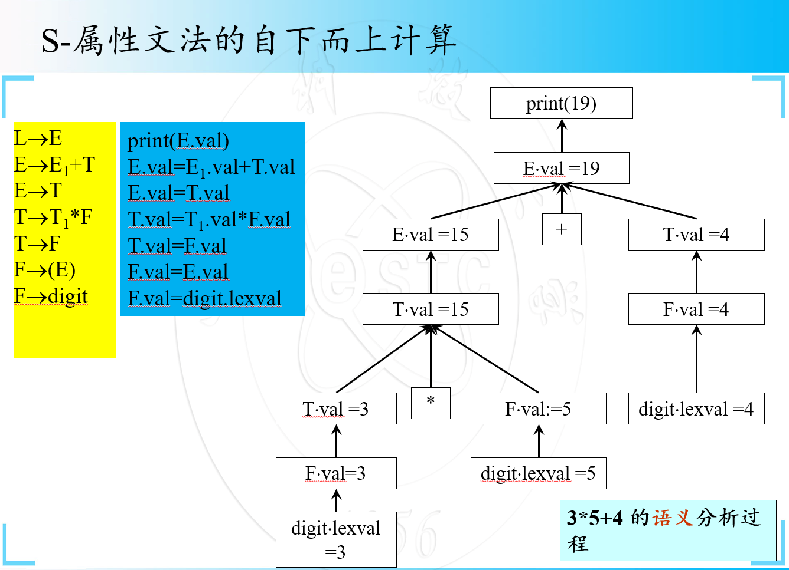
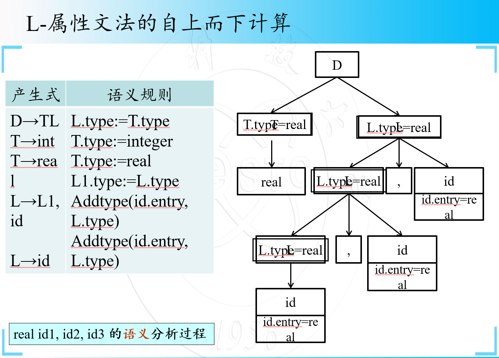

要挂科了。

很绝望。

来不及了。

一个源程序经过词法分析、语法分析之后，表明该源程序在单词书写上是正确的，并且符合程序语言所规定的语法结构。

词法分析以及语法分析并未对**程序内部的逻辑含义**加以分析，因此编译程序接下来的工作是**语义分析**。

好难啊，为什么要考这个，我又不是编译器方向的。

语义分析是审查源程序有无语义错误，为代码生成阶段收集信息。

语义分析的任务是对**结构上正确**的源程序进行上下文有关性质的审查，即进行类型审查。

**类型审查**是审查每个算符是否具有语言规范允许的运算对象，当不符合语言规范时，编译程序应报告错误。

第一次对源程序的语义作出解释，引起源程序**质的变化**。

#### 语义分析的方法

1. 语法制导翻译：在语法分析时不建立抽象语法树，而是直接生成中间代码，适用于文法比较简单的语言
2. 抽象语法树：以抽象语法树为基础进行语义分析及中间代码生成。在语法分析过程中建立抽象语法树是目前编译器的标准步骤。

## 1.属性文法

属性有不同的类型，可以被赋值（类似于变量），赋值规则附加于语法规则之上。赋值与语法同时进行，赋值过程就是语义处理过程。

其中，**继承属性的计算规则由顶向下，综合属性的计算规则由底向上。**

> 加深理解：
>
> [知乎|关于对编译原理中综合属性和继承属性的理解](https://zhuanlan.zhihu.com/p/514636508)

### 1.1综合属性：

在分析树节点N上的非终结符A的综合属性是由N上的产生式所关联的语义规则来定义的。

**A是产生式的左部**

节点N上的综合属性只能通过N的子节点或N本身的属性值来定义。

| E→E1+E2   | {E.val := E1.val + E2.val} |
| --------- | -------------------------- |
| **E→(E)** | **{E.val:=E1.val}**        |
| **E→i**   | **{E.val:=i.lex}**         |

### 1.2继承属性：

在分析树节点N上的非终结符B的继承属性是由N上的父节点上的产生式所关联的语义规则来定义的。

**B是产生式的右部某一个符号。**

节点N上的继承属性只能通过N的父节点、N本身和N的兄弟节点上的属性值来定义。

例如：添加标识符类型的语义描述。

（type为一个继承属性.）

| 产生式      | 语义规则                                           |
| ----------- | -------------------------------------------------- |
| **D→TL**    | **L.type:=T.type**                                 |
| **T→int**   | **T.type:=integer**                                |
| **T→real**  | **T.type:=real**                                   |
| **L→L1,id** | **L1.type:=L.type ** **Addtype(id.entry, L.type)** |
| **L→id**    | **Addtype(id.entry, L.type)**                      |

在这个规则当中：

- `D → T L` 的语义规则是 `L.type := T.type`。这里，`L.type` 是一个继承属性，因为它从兄弟节点 `T` 获取值。
- `T → int` 和 `T → real` 的语义规则分别设置 `T.type` 为 `integer` 或 `real`。这里，`T.type` 是一个综合属性，因为它从词法单元（`int` 或 `real`）直接获取值，并向上传递。
- `L → L1, id` 的语义规则是 `L1.type := L.type` 和 `Addtype(id.entry, L.type)`。这里，`L1.type` 是一个继承属性，因为它从父节点 `L` 继承 `L.type`。

## 2.属性计算方法

1. **树遍历的属性计算方法**

   假设语法树已经建立，并且树中已带有开始符号的继承属性和终结符的综合属性。然后以**某种次序**遍历语法树，直至计算出所有属性。最常用的遍历方法是深度优先，从左到右的遍历方法。如果需要的话，可使用多次遍历（或称遍）。

2. **一遍扫描的处理方法**

   与树遍历的属性计算文法不同，一遍扫描的处理方法是在语法分析的同时计算属性值，而不是语法分析构造语法树之后进行属性的计算，而且无需构造实际的语法树。因为一遍扫描的处理方法与语法分析器的相互作用，它与下面两个因素密切相关：（1）所采用的语法分析方法（2）属性的计算次序。

## 3.S-属性文法和L属性文法

**终结符号可以具有综合属性，但是不能有继承属性。终结符号的属性值由词法分析器提供。**

**非终结符既可以有综合属性，也可以有继承属性。但文法始符号的所有继承属性用于属性计算前的初始值。**

- 如果一个属性文法只含有综合属性，**则称为S-属性文法。**

好难啊要挂科了。

- 如果对于文法每个产生式A→X1X2…Xn，其每个语义规则中的每个属性或者是综合属性，或者是Xj(1≤j ≤n)的一个继承属性且这个继承属性仅依赖于：

  - (1)产生式Xj在左边符号X1, X2, … Xj-1的属性；

  - (2)A的继承属性；

    **则称为L-属性文法。**

### 3.1.S-属性文法的自下而上计算

S-属性文法只含有综合属性，因此可以在分析输入符号串的同时自下而上进行计算。分析器可以保存与栈中文法符号有关的综合属性值，每当进行规约时，新的属性值就由栈中正在规约的产生式右边符号的属性值来计算。

这个比较简单。课上多听几分钟真有用。

S-属性文法的翻译器通常可借助于LR分析器实现，对LR分析器进行改造，在对输入串进行语法分析的同时对属性进行计算。

### 3.2.L-属性文法的自上而下计算

L-属性文法允许一次遍历就计算出所有属性值。

LL(1)自上而下语法分析过程，可以看成是深度优先建立语法树的过程，因此，可以在自上而下语法分析的同时实现L-属性文法的计算。

