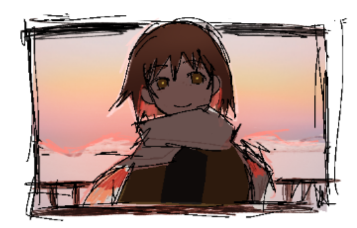
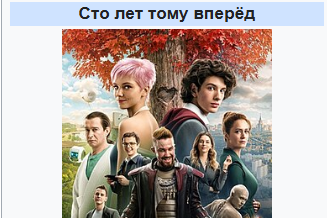
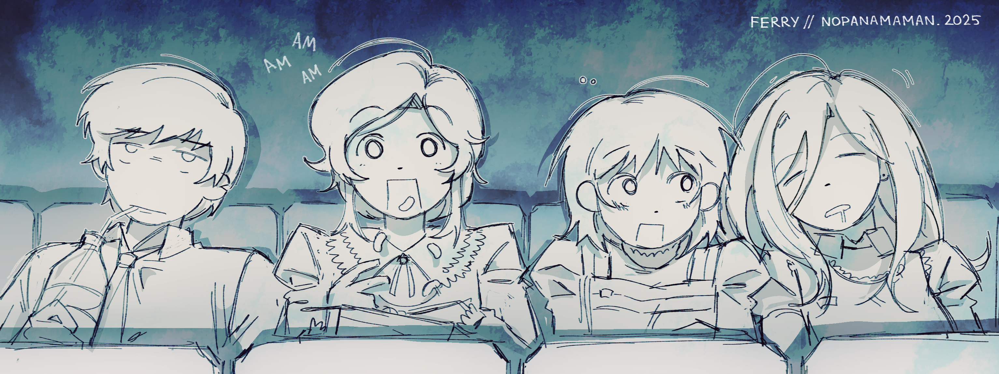
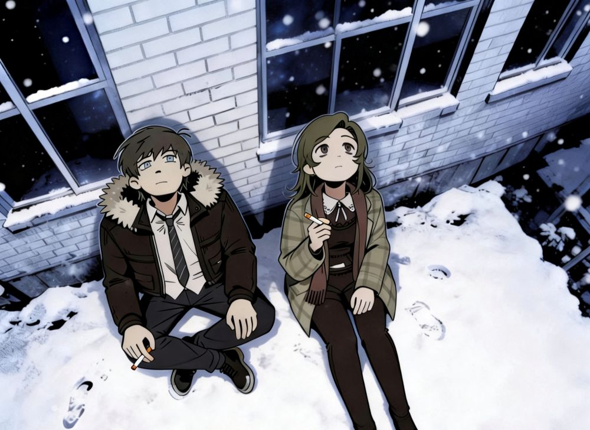
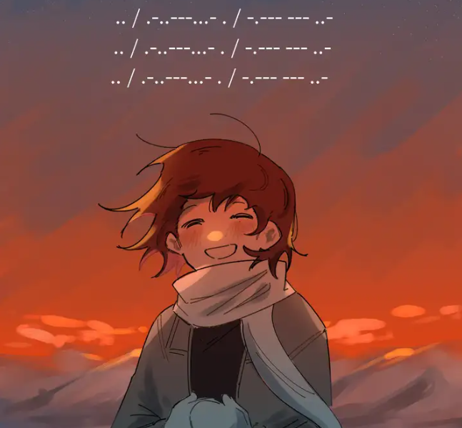
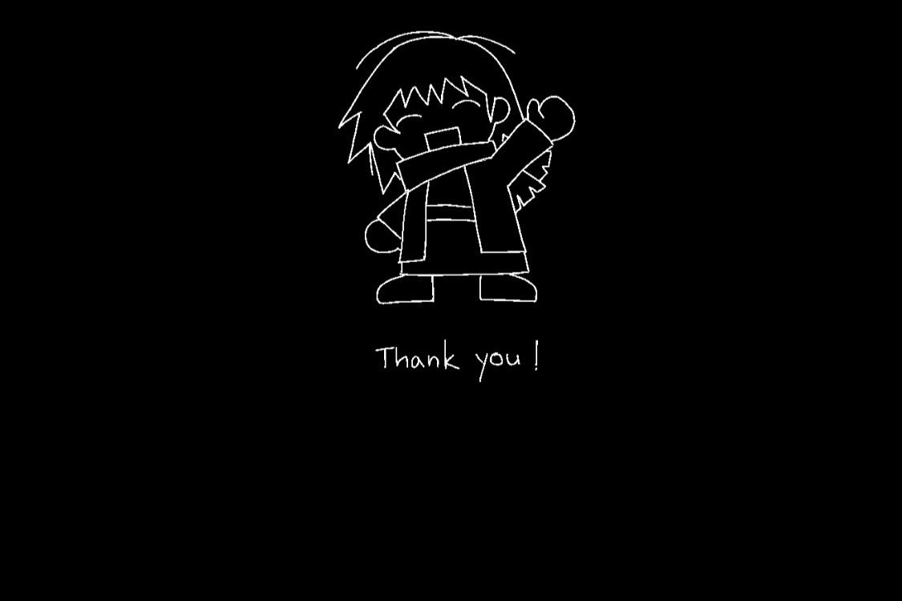

**这当然不只是一个关于“爱”的故事，但正如副标题“I love the world and everything in it”所写，这是一个由“爱”展开的故事。**

Asya的爱是动态的，从一开始她就偏执地爱这个世界，再后来具体到对Ira的爱（指广义上的爱，当然我并不反对百合 w），随着她一步步爬上信号塔，“自我”一点点溶解，这份“我爱你”又逐渐变成了对一切的爱。

## 写在前头：

ZATO的画风真的太舒服了，这是我阅读它的第一驱动力。其次是OP剪得真的太对味儿了，每次打开游戏都得溜一遍。（所有人都去听out of love！）

其实我是比较抗拒去阅读一些所谓的“电波作”小众作品的，这类作品大多数因为要“对电波”而褒贬不一，受众比较小；我无法接受的比如沙耶之歌，但是身边人里有的会给它打比较高的分数。

也许你不会喜欢它的剧情，但是作为一部视觉小说，它的美术编排和塑造的独特氛围无疑值得一试。

## 读后感

### Asya

> 但这世界未免太过温柔。
> 
> 对于我这种不知好歹的废人,它实在太过仁慈。

主角Asya是个很可爱的人，作者对其的心理描写很细腻；但是就我个人而言，完全没有代入感，每次看到熟悉经典的被霸凌场景时都有种拳头伸不进屏幕的难受感。

> "It's not like I never tried it before...! But when I say something, they just make fun of me. And nothing changes..."

经典的习得性无助？恨铁不成钢，我好想魂穿进去给Vadim来一巴掌，像Ira那样朝他扔椅子，告诉他“别来惹我了”。可惜她一直忍到了最后，霸凌的问题也一直没有解决。

一个忍气吞声惯了、把恶意包装成“可爱”、总是自欺欺人的圣母角色总是不讨喜的。在某些人眼里，这是过于痛苦而导致自我解离的表现。

不过我觉得也许她没有那么痛苦，考虑到她的思维方式，考虑到她异于常人的精神框架：

> "Even if you feel a bit under the weather, it's a good day. Even if you miss somebody really badly, it's a good day. Even if everything around you is changing in a way you fail to understand, it's a good day. The fleeting feelings of a human can't change the day's intrinsic qualities, can they?"

在Asya眼里，似乎每天都是好日子。她每天满怀着感激去拥抱和接受宇宙所给予她的一切。她真的相信宇宙作为一个需要被注视的个体，能够回应她的愿望。

她当然不是正常人，无论她痛不痛苦，她都真的饱含爱意。从思维高度来看，她是最接近“神”的存在（所以最后Tosya告诉她那几乎无所不能的超能力时 我一点也不意外）。

除了会写诗，Asya的脑子也很好使，可能是因为有代码敏感症。信息搜集得也比玩家快，经常没反应过来她到底想干啥。

Vortuka-5名侦探这一块，苏联自研凉宫春日这一块。

本质是世界上最可爱的抛物面天线（

### Tosya

Tosya是提及得特别早，但是直到最后才出场的人物；汽修厂那一段其实就暗示了她也许不是“人”；最后第三章也揭示了其诞生的原因正是Asya那“诚挚的愿望”。

这部分的解读太多了，因为是明确需要被解读的内容，所以我懒得再胡说八道了。

不过我看到有人认为“Tosya实际上是Asya在儿童读物中以其中的角色原型构建出来的幻想朋友”，理由是Asya看书的时候提到“一定要记住xxx的脸”，同时提到Alisa、Kolya、Tosya等名字。但是这本书是有现实原型的（《一百年以后》，A Hundred Years Ahead / Сто лет тому вперёд，1978年出版）：

Alisa、Kolya等正是其中的角色，并没有Tosya这一号人物。

所以Tosya并不是因为这本书的角色原型而诞生的，Asya也许只是在通过读书安慰自己的时候脑海里无意识闪回了Tosya。

关于Tosya的诞生，我也有个猜测：

在EP1里关于谁曾喜欢她的诗，asya说“Well, Tosya did.”，Tosya 是第一个告诉阿莎雅"我喜欢你的诗"的人，Ira是第二个。

也许阿莎雅最初的"诚挚的愿望"很简单，比如"我想要一个喜欢我写的诗的朋友"，而Tosya 就是这个愿望的回应。

也许没有多合理，但这很浪漫。

### Vadim & Marina

**唉，青梅。**

抛开后续的超展开，我一开始以为这是个校园霸凌和相互救赎的故事。

我很讨厌霸凌者，当然不是针对作品，单纯我就是讨厌这类角色。霸凌——被某些事情触动——改邪归正，这样的桥段已经烂大街了，我不喜欢，总是充斥着俗套的赎罪和双向奔赴。从被霸凌者的角度来看，我无法接受一切的赎罪：你要真想赎罪你就直接消失啊，别一直在受害者面前晃悠，自我感动自我欺骗。

而瓦学弟 Vadim 在前期塑造是个彻头彻尾的傻逼。

所以我一直在“期待”上述情节的发生，然后截图发到群里讨论，再锐评一句“这剧本太烂了”。

等到寻找Ira的剧情开始，我看到Vadim、Asya、Marina三个人合作、闲聊、散步、讨论通古斯大爆炸，相互拌嘴、扔石子、看电影之后，我又改变主意了。

作者太会写了。

我开始真正意义上的期待Vadim作为一个霸凌者的转变，这样也挺好，不是吗？理由我都给他找好了：契机就是这次冒险，Vadim的家庭情况也不好，家里人患病的压力很有可能是他霸凌的导火索，只要他承认自己的错误，学会释放善意，只要他能够真心向Asya道歉，制止班级里的霸凌事件再次发生，我知道Asya能原谅他。

从我的角度来看，Asya真的太可怜了，虽然她本人不这么觉得。我想他不需要彻底消失，哪怕只是陪陪Asya也好。反正就这俩人的性格也谈不起来恋爱，只要他别再欺负Asya就好了。

但是他没有。

这一天过后，所有人的性格仿佛被“神秘大手修正”了。取笑、欺负、霸凌还在继续，Vadim并没有学会善良。虽然Asya本人并不在乎。

没有解决任何问题，没有任何人物成长；他只是从一个彻头彻尾的傻逼，变成了一个有塑造的、立体的asshole（Marina语）。

我得说我依然讨厌他，但是我对他恨不起来。

最后Marina的病越来越严重，不能说话、眼神茫然、即将崩溃的那一刻，又是谁陪伴在她的身边？

> “草，雪还能往回飞的？”
> 
> 又看一章 (T⌓T)

也许这部作品根本没打算解决任何事情，它的核心不是关于"解决问题"，是关于在无法解决的问题中，我们还能做什么？

而关于Marina，我很难对她下一个判断，很难说她究竟被塑造成了什么样子，她也许只是一个在药物维持下假装正常的人，一个“functional”的人。她很清醒，也很可爱，是个有悲剧色彩的阳角。
### Ira

经典傲娇。

基本是正义的化身，但是也会崩溃，也有脆弱的一面。

印象比较深刻的对话有Asya说"我不觉得有谁可以被称为人渣败类"。Ira说"加林（Vadim）不就是吗"。Asya说 "他不是故意的。"

> "Uh-huh."

在那之后我和Ira发出了一样的、轻蔑的“嗯哼”。她的眼里恶就是恶，绝对想不出任何为作恶者开脱的理由。

宁可直面丑陋的真相，也不愿在药物的虚假平静中活着，最后因为一首诗而回到现实，紧接着又被大手“merged”了。融合？跟什么融合？这个世界吗？

最后三人在咖啡馆的玩乐幻想其实可能是真实存在的，Asya的愿望太强烈了，创造了一个美好的世界把三个人的意识拉进去了。虽然最后梦还是会醒的。

### 写在最后

剧本里没有什么戏剧性的反转，欺凌者未得到应有的惩罚，代码过敏的病症没有被解决，宇宙意识的修正无法被阻止。正如我之前所说，这部作品可能根本没打算解决任何事情。最后解决不了了，怎么办呢？把整个镇子都抹去就好了，什么都不存在了。什么都不需要被解决了。

但是它仍然带给了我很多惊喜。ZATO的超展开是意想不到的、精妙的，很突兀地直接甩到脸上，但是读者不会觉得匪夷所思和无法接受。Asya的碎碎念和莫名其妙的哲学思考在第二章末尾闭合，原来不是什么青春期幻想、自我麻痹、自我安慰，她真的被宇宙意识回应过，而且我和Asya一样不会感到意外，一切都是顺理成章的。

我也不打算讨论什么拉康、什么笛卡尔、什么黑格尔（因为我根本不懂qwq）。在这个荒谬而未知的世界里，它营造了足够我打出好评的“氛围感”，用很聪明的方式叙述了一个足够震撼的故事，这就够了。有很多人觉得它的内核不好，不认可Asya的内心世界和作者的那一套哲学理论，这也是正常的，不妨碍它是一部优秀的、值得一看的视觉小说。

创造一个能够和宇宙对话的女孩，让她走向最高的发射塔，在燃烧之前用满溢的爱意，向面前的自己告白。

> .-.- - . -... .-.- .-.. ..-- -... .-.. ..--
> 
> .-.- - . -... .-.- .-.. ..-- -... .-.. ..--
> 
> .-.- - . -... .-.- .-.. ..-- -... .-.. ..--

（我还对照了一下标准国际摩斯密码，发现根本对不上，问了下GPT才知道是俄语西里尔字母的摩斯码）

Я ТЕБЯ ЛЮБЛЮ. Я ТЕБЯ ЛЮБЛЮ. Я ТЕБЯ ЛЮБЛЮ。

宇宙的意识可以抹去 6000 人的存在。但无法阻止一个14岁的女孩对着全世界说"我爱你"。

我想这本身就很可爱。当然比起爱宇宙，我更希望Asya能爱自己。

谢谢你能看到这里，感谢宇宙的意志让我们相遇 。

