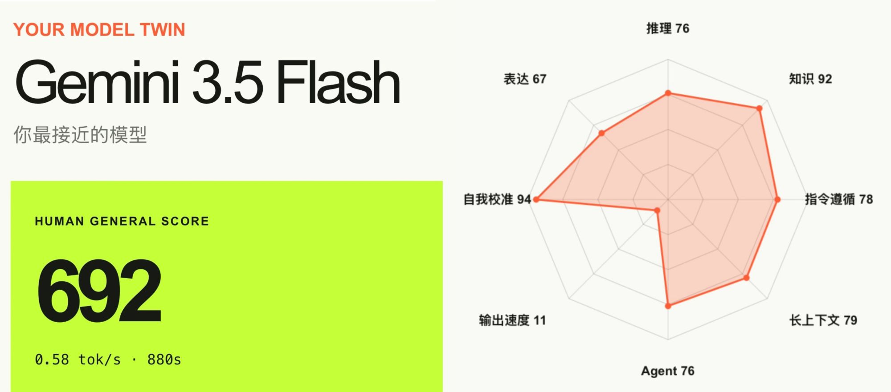

## 欢迎你的到来！

**此网站用于记录生活、学习，更新时间不定（~~我可能也懒得维护~~）。**

这个项目被搁置了太久太久了。最初想要做个博客是因为微光工作室的某一道招新题，我先用三件套构筑了一个还看得过去的博客（黑历史），后来尝试迁移到Vue，后来在网上发现了好多新奇的框架，再后来尝试把一些自己写的组件重构到某些好用且优雅的博客框架里......

我在b站上的一个前端初学者的展示博客的视频底下，看到了这样一句评论：“感觉实用性不大，只是为了好看而已。你对博客的热情也就仅限于你搭建博客的那几天，搭好了没两天就停更了，到最后就忘记有这么一回事了。”

我想起刚入学那会儿，我搭好了人生的第一个博客，积极地配置了域名、购买了服务器，再在认识的圈子里宣传了一番，然后就没有下文了。阿里云后台的浏览量在短短几天之内归零，我再也没回去维护过我的网站。个人的小博客哪有流量，都是做给自己看的。

于是我开始反思：我的热情到底源于什么？是刚接触前端的新鲜感，是第一次看到别人的、漂亮的博客主题的惊叹与羡慕，还是单纯想要展示自己那半桶水的技术？

工作室招新期间，我看着新生们交上来的招新题，想起去年为了做一个博客东奔西走讨教经验的自己，想起刚加入工作室的自己满怀期待地找了几个队友，打了几场不那么优雅的比赛。虽然没什么拿得出手的成绩，但我觉得还是有所收获的。

我想起去年的11月，我密谋许久，录下一段蹩脚的生日祝福。点击发送之前，那段没来得及说再见的友谊和自以为结束了的青春，又在我的脑海里闪回。

我想起今年年初，我遇见了我的小太阳，总是能找到我的优点，总是对我说：“你超级棒。”

也许生活没有我想象中的那么糟糕。

**我想，趁着我还有这份热情与憧憬，我要开始做点什么了。**

2025.10.12

---

## 关于我

**半吊子前端，随时可能陨落（~~被5小时限额~~）的天才程序员。**

电科大自研哈吉米 3.5 Flash （打字速度很慢。真的很慢。）

> 来自一个很有想法的[测试网站](https://api.reizeiin.xyz)

### Dr.Tonks?

既不是Doctor，也不是Tonks。

小时候特喜欢哈利波特，网名里Tonks的来源就是其中的唐克斯家（凤凰社安全屋）；Tonks本身不是古老的纯血大家族，是反抗纯血主义的家庭，一边是麻瓜出身，一边是逃离布莱克家族的纯血女巫；整个家族是比较悲壮的，在第二次巫师战争承受巨大牺牲：父亲被搜捕队杀害；女儿唐克斯、女婿卢平死于霍格沃茨决战；只留下小儿子泰迪。

后续染上了神秘博士，觉得Dalek和Dr.WHO老霸气了（不是剧情表现霸气，而是感觉念起来很霸气hhh），遂在网名前添了个Dr.

虽然有先射箭后画靶的嫌疑，但是我依然希望自己能承载起这个名字所带来的意义；倒不是说非得有什么某某主义、反抗精神云云，也许只是在我快要放弃的时候，能够提醒我坚持创作、想起上网的初衷，在互联网上留下属于我的痕迹。

我正试着第四次工业革命的浪潮里摸着石头过河。

## 关于本站的搭建

此网站使用 **Astro** 框架构建，基于 [fuwari](https://github.com/saicaca/fuwari) 主题，参考其他同类型博客并深度魔改。fuwari虽然已经烂大街了，但它的布局真的给我一种很清晰、很舒服的感觉，我很喜欢。视觉中心拿捏得很到位，柔和的过渡效果可能比较符合我的审美。也有尝试过一些科幻工业风格、后现代主义、极简风之类的主题，最后也还是回到了这里。

>特别感谢：

::github{repo="saicaca/fuwari"}
感谢原作者及后续社区项目提供的基础设计与实现。

>博客公开仓库：

::github{repo="DrTonks/tonks-blog"}